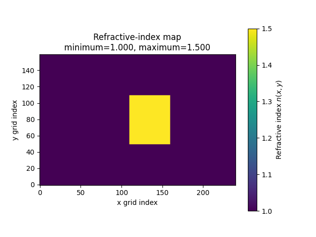
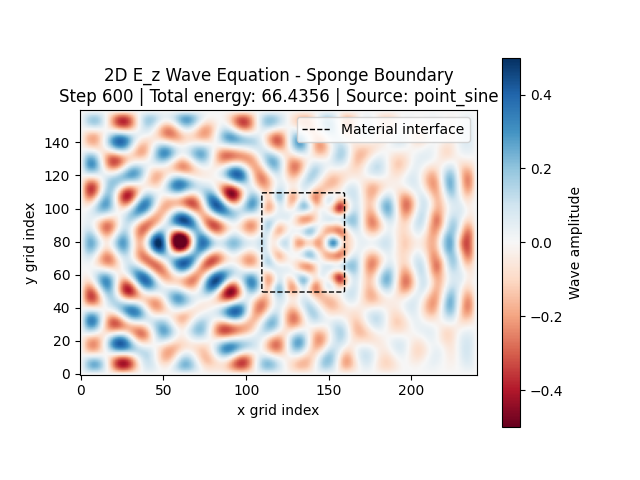
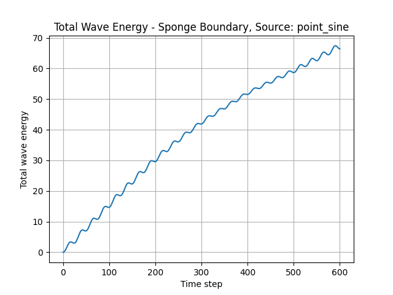
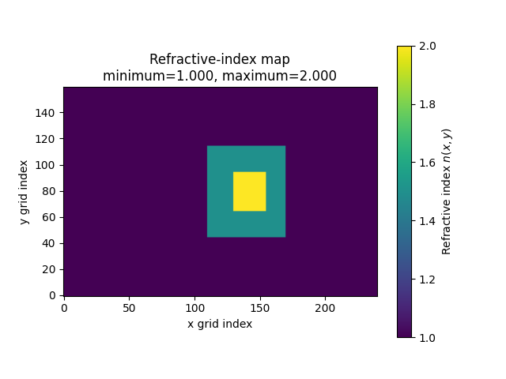
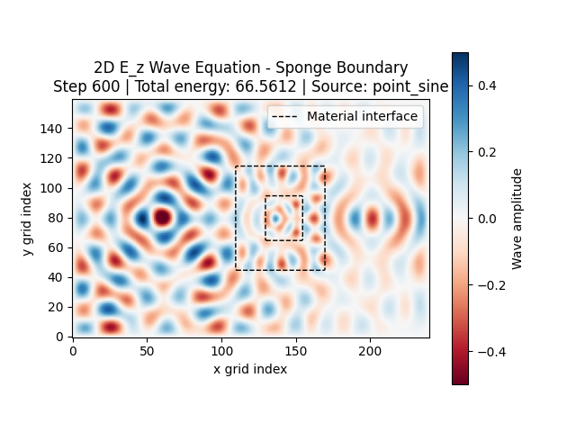

# Photonics Simulator

A Python toolkit for learning about, numerically simulating, and visualizing
two-dimensional wave propagation.

The project is being developed progressively. It begins with a scalar wave
equation and establishes the numerical and software foundations needed for
later work on dielectric interfaces, photonic geometries, and electromagnetic
FDTD methods.

## Current status

**Phase 3 - Controlled sources and field monitors is complete and
validated. The local milestone commit and tag identify this state; pushing is
handled separately.**

- Phase 1 implemented and validated the original two-dimensional scalar-wave
  solver.
- Phase 2.1 reorganized the solver into the reusable `wavesim` package without
  intentionally changing its numerical behavior.
- Phase 2.2 introduced validated refractive-index and wave-speed maps while
  keeping the default domain uniform.
- Phase 2.3 gave the scalar field an \(E_z\)-polarized interpretation and
  introduced one grid-aligned planar dielectric interface.
- Phase 2.4 introduced a finite rectangular dielectric region with validated
  half-open geometry bounds.
- Phase 2.5 separated geometry construction from material finalization and
  introduced reusable, composable rectangular-region operations.
- Phase 2.6 defined the stable public API and validated constructor
  compatibility, material invariants, CFL stability, wavelength resolution,
  simulation construction, and source-free energy behavior.
- Phase 3.1 protected the established point-source values, timing, spatial
  localization, additive behavior, and post-update injection order.
- Phase 3.2 introduced precomputed, validated, read-only spatial source
  profiles while preserving the exact Phase 2.1 numerical trajectory.
- Phase 3.3 added a finite-aperture vertical sinusoidal line source and a
  configurable sine-squared turn-on ramp.
- Phase 3.4 added named point and vertical-line field monitors with histories
  aligned to the completed simulation time levels.
- Phase 3.5 added headless single-frequency amplitude and phase estimation.
- Phase 3.6 validated controlled propagation through a uniform medium against
  the finite-difference numerical dispersion relation.
- Phase 3.7 added matched uniform-reference and dielectric-interface runs for
  separating incident, reflected, and transmitted harmonic fields.
- Phase 3.8 added source and monitor overlays, monitor-history plots, and
  shaded harmonic-analysis windows.
- Phase 3.9 defines the stable Phase 3 API and completes cross-feature
  validation, technical documentation, and the final repository audit.

The default uniform simulation and continuous point source remain numerically
identical to the verified Phase 2.1 simulation. The Phase 2 material scenarios
continue to demonstrate an unbounded planar interface, a finite dielectric
object, and a nested three-material composite.

The composite scenario uses ordered geometry operations to place an
\(n=2.0\) core inside an \(n=1.5\) outer rectangle. It demonstrates explicit
overlap behavior, multiple interfaces, shorter internal wavelengths, slower
propagation, scattering, and internal interference.

Phase 3 adds a controlled uniform-medium scenario and a paired reference/
interface experiment. The controlled scenario verifies finite-aperture
amplitude consistency and numerical phase advance. The paired experiment
isolates the reflected response by subtracting the matched uniform reference
from the upstream interface response.

The Phase 2 baseline contains 59 tests. The completed Phase 3 suite contains
139 tests spanning the Phase 2 contract and the new source, monitor,
harmonic-analysis, scenario, visualization, and public-API behavior. All 139
tests pass. The Phase 2 source-free composite energy result remains within a
maximum observed deviation of approximately 2.8%.

## Governing model

The current solver advances the variable-speed scalar wave equation

```math
\frac{\partial^2 u}{\partial t^2}
=
c(x,y)^2
\left(
\frac{\partial^2 u}{\partial x^2}
+
\frac{\partial^2 u}{\partial y^2}
\right).
```

From Phase 2.3 onward, the field is interpreted as:

```math
u(x,y,t)=E_z(x,y,t),
```

where:

- \(E_z(x,y,t)\) is the out-of-plane electric-field component;
- \(c(x,y)\) is the local propagation speed;
- \(x\) and \(y\) are spatial coordinates;
- \(t\) is time.

The material relationship is

```math
c(x,y)=\frac{c_{\mathrm{ref}}}{n(x,y)},
```

where \(c_{\mathrm{ref}}\) is the reference wave speed and \(n(x,y)\) is the
refractive-index map.

The project currently uses normalized simulation units. The default material
configuration is

```text
c_ref = 1
n(x,y) = 1
c(x,y) = 1
```

throughout the default domain.

The selected \(E_z\) model assumes a two-dimensional, isotropic, lossless,
nondispersive dielectric with spatially constant magnetic permeability. It is
a reduced second-order electromagnetic model, not a complete vector Maxwell
FDTD solver.

At an ordinary interface between the selected nonmagnetic dielectrics, the
continuous model requires:

```math
E_{z,1}=E_{z,2}
```

and:

```math
\frac{\partial E_{z,1}}{\partial n}
=
\frac{\partial E_{z,2}}{\partial n}.
```

## Numerical method

The equation is discretized on a two-dimensional Cartesian grid using
second-order centered finite differences in space and time.

For interior grid cells, the undamped update is

```math
u_{i,j}^{n+1}
=
2u_{i,j}^{n}
-
u_{i,j}^{n-1}
+
\Delta t^2 c_{i,j}^2
\nabla_h^2 u_{i,j}^{n}.
```

Only interior cells are updated. The outermost cells are reserved for the
boundary condition.

For a Gaussian initial field with zero initial velocity, the previous time
level is initialized using

```math
u^{-1}
=
u^0
+
\frac{1}{2}
\Delta t^2 c(x,y)^2
\nabla_h^2 u^0.
```

## Features

The current implementation includes:

- explicit finite-difference time stepping;
- a two-dimensional Cartesian grid;
- spatial refractive-index and wave-speed arrays;
- uniform material-map construction;
- vertical planar-interface material-map construction;
- rectangular dielectric material-map construction with validated half-open
  bounds;
- reusable background refractive-index construction;
- non-mutating rectangular-region composition;
- explicit last-operation-wins overlap behavior;
- centralized material-map finalization from refractive-index arrays;
- validation of material values and array shapes;
- optional injection of preconstructed material maps;
- CFL stability validation using the fastest wave speed in the domain;
- Gaussian and zero-field initial conditions;
- an optional continuous sinusoidal point source;
- precomputed and validated spatial source profiles;
- read-only source profiles during active simulations;
- finite-aperture vertical sinusoidal line sources;
- configurable sine-squared source turn-on ramps;
- named point field monitors;
- named vertical-line field monitors;
- coherent line-mean field sampling;
- monitor histories aligned with completed simulation time levels;
- single-frequency harmonic amplitude and phase estimation;
- explicit half-open steady-state analysis windows;
- fixed reflective boundaries;
- sponge absorbing boundaries;
- animated wave-field visualization;
- refractive-index-map visualization;
- material-interface contours on the wave animation;
- sponge-profile visualization;
- scalar-wave energy diagnostics;
- source wavelength and grid-resolution diagnostics;
- source and monitor overlays on the wave animation;
- monitor-history visualization with shaded analysis windows;
- a dedicated planar-interface scenario;
- a dedicated rectangular-dielectric scenario;
- a dedicated nested composite-geometry scenario;
- a dedicated controlled line-source propagation scenario;
- a paired uniform-reference and planar-interface measurement scenario;
- headless propagation verification across planar, rectangular, and composite
  dielectric geometries;
- an explicit package-level public API;
- compatibility validation between convenience constructors and reusable
  composition;
- a cross-scenario material, CFL, wavelength, and solver validation matrix;
- source-free composite energy-conservation verification;
- numerical-dispersion phase validation;
- paired-run incident and reflected harmonic-field separation;
- analytical scalar-interface coefficient validation;
- regression tests that preserve the verified Phase 2.1 results.

## Project architecture

The reusable package is named `wavesim`.

```text
photonics-simulator/
|-- wavesim/
|   |-- __init__.py
|   |-- analysis.py
|   |-- config.py
|   |-- materials.py
|   |-- monitors.py
|   |-- solver.py
|   |-- sources.py
|   `-- visualization.py
|-- simulations/
|   |-- foundations/
|   |   `-- wave2d_basic.py
|   |-- materials/
|   |   |-- wave2d_composite_geometry.py
|   |   |-- wave2d_planar_interface.py
|   |   `-- wave2d_rectangular_dielectric.py
|   |-- measurements/
|   |   |-- wave2d_controlled_line_source.py
|   |   `-- wave2d_interface_measurement.py
|   |-- __init__.py
|   `-- READ.md
|-- tests/
|   |-- unit/
|   |-- scenarios/
|   |-- validation/
|   |-- __init__.py
|   `-- READ.md
|-- notes/
|   |-- READ.md
|   |-- mathematics/
|   |-- physics/
|   `-- simulation-logs/
|-- outputs/
|   `-- figures/
|-- README.md
`-- requirements.txt
```

### Module responsibilities

`wavesim/__init__.py`

- the stable package-level public API;
- configuration, material, geometry, and solver exports.

`wavesim/config.py`

- frozen configuration dataclasses;
- source and monitor configuration;
- configuration validation;
- CFL calculation and validation;
- configuration and wavelength reporting.

`wavesim/materials.py`

- `MaterialMap`;
- uniform material-map construction;
- planar-interface material-map construction;
- rectangular dielectric material-map construction;
- reusable refractive-index geometry operations;
- defensive material-map finalization;
- material-array validation.

`wavesim/sources.py`

- point and vertical-line source-profile construction;
- spatial source-profile validation;
- sine-squared turn-on envelopes;
- additive time-harmonic source application.

`wavesim/monitors.py`

- point and vertical-line sampling;
- coherent spatial-mean reduction;
- monitor-history initialization and recording.

`wavesim/analysis.py`

- headless single-frequency harmonic analysis;
- amplitude, phase, duration, and cycle-count reporting;
- validation of temporal sampling and analysis windows.

`wavesim/solver.py`

- finite-difference operators;
- initial-condition construction;
- boundary handling;
- damping-profile construction;
- energy calculation;
- simulation state and time stepping;
- precomputed source-profile ownership;
- time-aligned monitor sampling;
- validation and use of optionally supplied material maps.

The solver does not depend on Matplotlib and can be used in tests or future
headless workflows.

`wavesim/visualization.py`

- material and damping profile figures;
- material-interface contours;
- source and monitor overlays;
- wave animation;
- energy-history plotting;
- monitor-history and analysis-window plotting;
- the interactive simulation workflow.

The executable scenarios are grouped by purpose in
[simulations/READ.md](simulations/READ.md): foundational propagation,
dielectric material geometries, and controlled measurements.

`simulations/foundations/wave2d_basic.py`

- a thin executable entry point that creates the default configuration and
  launches the interactive workflow.

`simulations/materials/wave2d_planar_interface.py`

- a headless-compatible scenario constructor;
- a \(240\times160\) interface experiment;
- a thin interactive entry point for the Phase 2.3 simulation.

`simulations/materials/wave2d_rectangular_dielectric.py`

- a headless-compatible scenario constructor;
- a \(240\times160\) finite dielectric-object experiment;
- a thin interactive entry point for the Phase 2.4 simulation.

`simulations/materials/wave2d_composite_geometry.py`

- a headless-compatible scenario constructor;
- a nested \(n=1.5\) outer region and \(n=2.0\) core;
- a thin interactive entry point for the Phase 2.5 simulation.

`simulations/measurements/wave2d_controlled_line_source.py`

- a headless-compatible uniform-medium scenario constructor;
- a ramped finite-aperture line source and two coherent line monitors;
- numerical phase validation and an interactive visualization entry point.

`simulations/measurements/wave2d_interface_measurement.py`

- matched uniform-reference and dielectric-interface construction;
- headless paired execution;
- incident, reflected, and transmitted harmonic-response analysis.

The intended responsibility flow is

```text
config
  |-- materials
  |-- sources
  `-- monitors
          |
          v
        solver
          |
          v
recorded histories -> analysis -> visualization and scenario reporting
```

`analysis.py` is a pure consumer of scalar histories and does not depend on
the solver. The solver, source, monitor, material, and analysis modules remain
independent of Matplotlib.

### Public package API

Phase 2.6 defined the original supported package-level API. Phase 3 adds the
stable monitor and harmonic-analysis types. Core types and operations can be
imported directly:

```python
from wavesim import (
    FieldMonitorConfig,
    FieldMonitorState,
    GridConfig,
    HarmonicResponse,
    MaterialConfig,
    MaterialMap,
    Wave2DSimulation,
    add_rectangular_region,
    create_background_refractive_index_array,
    create_material_map_from_refractive_index,
    create_planar_interface_material_map,
    create_rectangular_material_map,
    create_uniform_material_map,
    estimate_harmonic_response,
)
```

Existing imports from `wavesim.config`, `wavesim.materials`,
`wavesim.solver`, `wavesim.monitors`, and `wavesim.analysis` remain supported.
The public names are listed in `wavesim.__all__` and protected by the Phase 2
and Phase 3 validation suites.

## Configuration

Configuration values are grouped into frozen dataclasses:

- `GridConfig`;
- `TimeConfig`;
- `MaterialConfig`;
- `InitialConditionConfig`;
- `SourceConfig`;
- `FieldMonitorConfig`;
- `BoundaryConfig`;
- `VisualizationConfig`;
- `SimulationConfig`.

`SimulationConfig.monitors` is an immutable tuple and defaults to an empty
tuple, so existing configurations remain compatible.

The default configuration can be created with

```python
from wavesim.config import create_default_config

config = create_default_config()
```

Because the dataclasses are frozen, variations can be constructed safely with
`dataclasses.replace`:

```python
from dataclasses import replace

from wavesim.config import create_default_config

config = create_default_config()
config = replace(
    config,
    material=replace(
        config.material,
        background_refractive_index=2.0,
    ),
)
```

This example creates a uniform medium with

```math
n=2,
\qquad
c=\frac{1}{2}.
```

### Default numerical configuration

```text
Grid
    nx = 150
    ny = 150
    dx = 1.0
    dy = 1.0

Time
    dt = 0.4
    steps = 500

Material
    reference wave speed = 1.0
    background refractive index = 1.0

Initial condition
    kind = zero
    Gaussian center = grid center
    sigma = 8.0

Source
    kind = point_sine
    position = grid center
    amplitude = 0.5
    frequency = 0.075
    ramp = 0 cycles

Field monitors
    none

Boundary
    kind = sponge
    damping width = 50
    maximum damping = 0.02
    damping exponent = 2
```

## Material maps

### Uniform map

The default simulation constructs a uniform map:

```python
from wavesim.materials import create_uniform_material_map

material_map = create_uniform_material_map(
    config.grid,
    config.material,
)
```

Every cell receives:

```math
n(x,y)=n_{\mathrm{background}}
```

and:

```math
c(x,y)=\frac{c_{\mathrm{ref}}}{n(x,y)}.
```

### Planar interface

Phase 2.3 adds:

```python
from wavesim.materials import (
    create_planar_interface_material_map,
)

material_map = create_planar_interface_material_map(
    config.grid,
    config.material,
    interface_index=120,
    right_refractive_index=1.5,
)
```

The material convention is:

```python
refractive_index[:interface_index, :] = n_left
refractive_index[interface_index:, :] = n_right
```

The interface lies between x indices `interface_index - 1` and
`interface_index`. The left material uses the configured background index.

### Rectangular dielectric

Phase 2.4 adds:

```python
from wavesim.materials import (
    create_rectangular_material_map,
)

material_map = create_rectangular_material_map(
    config.grid,
    config.material,
    x_start=110,
    x_stop=160,
    y_start=50,
    y_stop=110,
    rectangle_refractive_index=1.5,
)
```

Rectangle bounds use the standard NumPy half-open convention:

```python
refractive_index[
    x_start:x_stop,
    y_start:y_stop,
] = rectangle_refractive_index
```

Therefore, the example rectangle occupies:

```text
x indices 110 through 159
y indices 50 through 109
```

and has dimensions:

```text
width = 50 cells
height = 60 cells
```

All remaining cells use the configured background refractive index. The
corresponding wave-speed array is derived using:

```math
c(x,y)=\frac{c_{\mathrm{ref}}}{n(x,y)}.
```

The bounds must be integers and must define a nonempty rectangle strictly
inside the grid. The rectangular refractive index must be finite and positive.

### Reusable geometry composition

Phase 2.5 separates geometry construction from material finalization:

```python
from wavesim.materials import (
    add_rectangular_region,
    create_background_refractive_index_array,
    create_material_map_from_refractive_index,
)

refractive_index = (
    create_background_refractive_index_array(
        config.grid,
        config.material,
    )
)

refractive_index = add_rectangular_region(
    refractive_index,
    config.grid,
    x_start=110,
    x_stop=170,
    y_start=45,
    y_stop=115,
    region_refractive_index=1.5,
)

refractive_index = add_rectangular_region(
    refractive_index,
    config.grid,
    x_start=130,
    x_stop=155,
    y_start=65,
    y_stop=95,
    region_refractive_index=2.0,
)

material_map = create_material_map_from_refractive_index(
    config.grid,
    config.material,
    refractive_index,
)
```

Each geometry operation returns a new floating-point array and leaves its input
unchanged. Rectangles use half-open bounds and may touch a grid edge. When
regions overlap, the later operation overwrites earlier values in the
overlapping cells.

Material finalization makes another defensive copy, validates the completed
refractive-index array, and derives:

```math
c(x,y)=\frac{c_{\mathrm{ref}}}{n(x,y)}.
```

The existing uniform, planar-interface, and embedded-rectangle constructors
remain available. They now use the same reusable construction and finalization
pipeline internally.

Prepared maps can be supplied explicitly:

```python
from wavesim.solver import Wave2DSimulation

simulation = Wave2DSimulation(
    config,
    material_map=material_map,
)
```

When no map is supplied, `Wave2DSimulation` constructs the default uniform map.
Every active map is validated before field allocation and CFL validation.

## Initial conditions

Supported initial conditions are:

```python
kind = "gaussian"
```

This creates a localized Gaussian pulse with zero initial velocity.

```python
kind = "zero"
```

This starts the field from rest and is normally combined with a continuous
source.

## Sources

Supported source types are:

```python
kind = "none"
```

```python
kind = "point_sine"
```

and

```python
kind = "line_sine"
```

The point source is

```math
s(t)=A\sin(2\pi f t)
```

and is added at one grid cell after the finite-difference wave update. That
source ordering is intentional and is protected by the numerical regression
test.

Every source is represented internally by a floating-point spatial profile
with the same shape as the simulation grid. Profiles are validated during
simulation construction, marked read-only, and reused at every time step.

The point profile contains one unit-weight cell:

```python
profile[source.x, source.y] = 1.0
```

The vertical line profile uses half-open transverse bounds:

```python
profile[
    source.x,
    source.y_start:source.y_stop,
] = 1.0
```

The final occupied transverse index is therefore `y_stop - 1`.

### Source turn-on ramp

Active sources may use a sine-squared turn-on ramp specified in source cycles.
For `ramp_cycles = N_ramp`, the duration is:

```math
T_r=\frac{N_{\mathrm{ramp}}}{f}.
```

The envelope is:

```math
g(t)
=
\begin{cases}
\sin^2\left(\dfrac{\pi t}{2T_r}\right), & 0\le t<T_r,\\
1, & t\ge T_r.
\end{cases}
```

The distributed source is:

```math
s(x,y,t)
=
A\,g(t)\sin(2\pi ft)\,p(x,y),
```

where (p(x,y)) is the precomputed spatial profile. The default
`ramp_cycles = 0` gives a unit envelope and preserves the established point
source exactly.

The nominal wavelength at the source is calculated from the local wave speed:

```math
\lambda=\frac{c_{\mathrm{source}}}{f}.
```

The program reports grid points per wavelength and warns when the spatial
resolution falls below ten points per wavelength.

## Field monitors

Phase 3 supports named field monitors configured through
`FieldMonitorConfig`.

Point monitors sample:

```python
field[monitor.x, monitor.y]
```

Vertical-line monitors sample the half-open interval:

```python
field[
    monitor.x,
    monitor.y_start:monitor.y_stop,
]
```

and initially support the coherent spatial mean:

```math
\bar E_z(x,t)
=
\frac{1}{N_y}
\sum_j E_z(x,j,t).
```

The coherent mean retains sign and phase information. An RMS reduction would
discard both and is therefore not used for the harmonic measurements.

Each `FieldMonitorState` stores parallel lists of:

```text
steps
times
values
```

Histories begin with the initial field at step 0 and time 0. Each subsequent
sample is recorded after the wave update, source injection, energy calculation,
and state promotion. Monitor sample (n) therefore represents the completed
field at:

```math
t_n=n\Delta t.
```

After (N) calls to `advance()`, monitor and energy histories both contain
(N+1) entries.

## Harmonic-response analysis

`estimate_harmonic_response` estimates a single complex temporal harmonic from
any one-dimensional scalar history. It removes the mean of the selected
half-open window and computes:

```math
\tilde E_z(f)
=
\frac{2}{N}
\sum_{n=n_0}^{n_1-1}
\left(E_{z,n}-\bar E_z\right)
e^{-i2\pi f t_n}.
```

For the cosine-based phase convention:

```math
A\cos(2\pi ft+\phi)
\quad\Longrightarrow\quad
\tilde E_z=Ae^{i\phi}.
```

Thus a sine source has phase (-\pi/2). `HarmonicResponse` reports the complex
amplitude, magnitude, phase, frequency, window bounds, sample count, duration,
and cycle count. Analysis validates finite samples, time step, frequency,
temporal Nyquist, window bounds, and a minimum number of cycles.

## Boundary conditions

### Fixed boundary

```python
kind = "fixed"
```

The outermost cells satisfy

```math
u=0.
```

This homogeneous Dirichlet condition produces strong reflections.

### Sponge boundary

```python
kind = "sponge"
```

A spatial damping coefficient \(\gamma(x,y)\) increases smoothly toward the
domain edges. The damped model is approximately

```math
u_{tt}
+
\gamma(x,y)u_t
=
c(x,y)^2\nabla^2u.
```

The sponge reduces artificial reflections but is not a perfectly matched
layer.

## CFL stability

The two-dimensional CFL estimate uses the maximum wave speed anywhere in the
material map:

```math
C
=
c_{\max}\Delta t
\sqrt{
\frac{1}{\Delta x^2}
+
\frac{1}{\Delta y^2}
}.
```

The simulation requires

```math
C\leq 1.
```

The program raises an error when the configured time step is unstable.

## Energy diagnostic

For the selected second-order \(E_z\) equation, the implemented mathematical
wave-energy diagnostic is

```math
E
\approx
\sum_{i,j}
\left[
\frac{1}{2c_{i,j}^2}u_t^2
+
\frac{1}{2}
\left(
u_x^2+u_y^2
\right)
\right]
\Delta x\Delta y.
```

For a source-free simulation with nonzero initial energy, the program plots
normalized remaining energy:

```math
\frac{E(t)}{E(0)}.
```

For a continuously driven simulation, the source continually injects energy,
so the program plots absolute total energy \(E(t)\).

The diagnostic is primarily intended for comparisons between simulations that
use compatible numerical parameters.

It is not the complete instantaneous Maxwell energy:

```math
E_{\mathrm{EM}}
=
\int
\left[
\frac{1}{2}\varepsilon|\mathbf{E}|^2
+
\frac{1}{2}\mu|\mathbf{H}|^2
\right]
dA,
```

because the current solver does not explicitly store \(H_x\) and \(H_y\).

## Requirements

- Python 3;
- NumPy;
- Matplotlib.

Install the dependencies with

```powershell
pip install -r requirements.txt
```

A project virtual environment is recommended. On Windows PowerShell:

```powershell
python -m venv .venv
.\.venv\Scripts\Activate.ps1
pip install -r requirements.txt
```

## Running the simulation

Run commands from the repository root.

Activate the virtual environment, then run the default uniform simulation:

```powershell
python -m simulations.foundations.wave2d_basic
```

Run the Phase 2.3 planar-interface scenario with:

```powershell
python -m simulations.materials.wave2d_planar_interface
```

Run the Phase 2.4 rectangular-dielectric scenario with:

```powershell
python -m simulations.materials.wave2d_rectangular_dielectric
```

Run the Phase 2.5 composite-geometry scenario with:

```powershell
python -m simulations.materials.wave2d_composite_geometry
```

Run the Phase 3 controlled line-source scenario with:

```powershell
python -m simulations.measurements.wave2d_controlled_line_source
```

Run the paired Phase 3 reference/interface measurement headlessly with:

```powershell
python -m simulations.measurements.wave2d_interface_measurement
```

Module execution is required because `simulations` imports the reusable
top-level `wavesim` package. Direct execution such as
`python simulations\foundations\wave2d_basic.py` may not include the
repository root in the module search path.

The interactive workflow:

1. validates the configuration;
2. constructs and validates the material map;
3. checks CFL stability;
4. prints configuration and material diagnostics;
5. displays the refractive-index map;
6. displays the sponge profile when enabled;
7. animates the field with configured source and monitor overlays;
8. displays monitor histories and the optional harmonic-analysis window;
9. displays the energy history after the animation closes.

### Controlled line-source scenario

The Phase 3 controlled propagation scenario uses:

```text
Grid
    nx = 260
    ny = 180
    dt = 0.4
    steps = 700

Material
    refractive index = 1.0
    wave speed = 1.0

Line source
    x = 45
    y indices = [35, 145)
    amplitude = 0.5
    frequency = 0.05
    ramp = 4 cycles

First line monitor
    x = 90
    y indices = [60, 120)

Second line monitor
    x = 125
    y indices = [60, 120)

Boundary
    kind = sponge
    damping width = 25

Harmonic analysis
    steps = [450, 700)
    samples = 250
    duration = 100
    cycles = 5
```

The nominal wavelength is 20 cells. The monitors are separated by 35 cells,
or 1.75 nominal wavelengths, so the wrapped phase difference is nontrivial.
The measured phase advance is validated against the finite-difference
dispersion relation:

```math
\sin^2\left(\frac{\omega\Delta t}{2}\right)
=
\left(\frac{c\Delta t}{\Delta x}\right)^2
\sin^2\left(\frac{k_h\Delta x}{2}\right).
```

The source and monitor apertures remain outside the sponge. The interactive
workflow displays their positions, both time histories, and the shaded
five-cycle analysis window.

### Paired interface-measurement scenario

The paired Phase 3 experiment uses one common configuration with two material
maps:

```text
Reference run
    uniform n = 1.0

Interface run
    n_left = 1.0
    n_right = 1.5
    interface x index = 180
```

The common measurement geometry is:

```text
Grid
    nx = 340
    ny = 180
    dt = 0.4
    steps = 900

Line source
    x = 45
    y indices = [35, 145)
    frequency = 0.05
    ramp = 4 cycles

Upstream monitor
    x = 110
    y indices = [60, 120)

Downstream monitor
    x = 225
    y indices = [60, 120)

Harmonic analysis
    steps = [750, 900)
    samples = 150
    duration = 60
    cycles = 3
```

The incident response is the upstream uniform-reference response. Matched-run
subtraction isolates the reflected response:

```math
\tilde E_r
=
\tilde E_{\mathrm{interface,upstream}}
-
\tilde E_{\mathrm{reference,upstream}}.
```

The measured ratios are:

```math
r_{\mathrm{measured}}
=
\frac{\tilde E_r}{\tilde E_i},
```

and:

```math
t_{\mathrm{measured}}
=
\frac{\tilde E_{\mathrm{interface,downstream}}}
{\tilde E_{\mathrm{reference,downstream}}}.
```

For the ideal scalar infinite-plane-wave interface, the analytical values are:

```text
r = -0.2
|r| = 0.2
t = 0.8
R = 0.04
T = 0.96
R + T = 1.0
```

The recorded finite-aperture measurements are approximately:

```text
|r| = 0.155402
|t| = 0.637483
R = 0.024150
T = 0.609576
R + T = 0.633726
```

The measured (R+T) is not a complete conservation measurement. The finite
source and central line monitors do not integrate flux across the transverse
domain; diffraction redistributes field outside the monitor aperture, and the
sponge removes part of that field. The tests therefore require finite,
positive, physically scaled responses while testing exact flux balance only
for the analytical infinite-plane-wave coefficients.

### Planar-interface scenario

The Phase 2.3 scenario uses:

```text
Grid
    nx = 240
    ny = 160
    dt = 0.4
    steps = 600

Material 1
    n_1 = 1.0
    c_1 = 1.0

Material 2
    n_2 = 1.5
    c_2 = 0.667

Geometry
    vertical interface at x index 120

Source
    position = (60, 80)
    frequency = 0.05

Boundary
    kind = sponge
    damping width = 25
```

The source frequency gives:

```math
\lambda_1=20
```

and:

```math
\lambda_2\approx13.33,
```

so both materials remain above the ten-points-per-wavelength guideline.

The material map is:


The interactive result shows qualitative:

- reflection into the \(n=1.0\) material;
- transmission into the \(n=1.5\) material;
- shorter wavelength and slower propagation in the higher-index material;
- refraction of non-normal parts of the circular wavefront.

The point source reaches the interface over many incidence angles, so this
scenario is not used to measure Fresnel coefficients quantitatively.

### Rectangular-dielectric scenario

The Phase 2.4 scenario uses:

```text
Grid
    nx = 240
    ny = 160
    dt = 0.4
    steps = 600

Background material
    refractive index = 1.0
    wave speed = 1.0

Rectangular material
    refractive index = 1.5
    wave speed = 0.667

Geometry
    x indices = [110, 160)
    y indices = [50, 110)
    width = 50 cells
    height = 60 cells

Source
    position = (60, 80)
    frequency = 0.05

Boundary
    kind = sponge
    damping width = 25
```

The source is horizontally aligned with the center of the rectangle. Both
materials remain above the ten-points-per-wavelength resolution guideline.

The material map is:



A representative field after 600 steps is:



The scalar-wave energy history is:



The interactive result qualitatively shows:

- reflection from the front surface;
- propagation into and through the higher-index region;
- shorter wavelength and slower propagation inside the rectangle;
- transmission through the rear surface;
- diffraction around the upper and lower edges;
- internal interference produced by multiple material boundaries.

The energy rises because the continuous source injects energy throughout the
simulation. Its smooth, bounded behavior over 600 steps provides an additional
numerical-stability check.

The localized point source produces circular waves over many incidence angles.
The scenario is therefore intended as a qualitative finite-object scattering
experiment rather than a quantitative Fresnel measurement.

### Composite-geometry scenario

The Phase 2.5 scenario uses:

```text
Grid
    nx = 240
    ny = 160
    dt = 0.4
    steps = 600

Background
    refractive index = 1.0
    wave speed = 1.0

Outer rectangle
    x indices = [110, 170)
    y indices = [45, 115)
    refractive index = 1.5
    wave speed = 0.667

Nested core
    x indices = [130, 155)
    y indices = [65, 95)
    refractive index = 2.0
    wave speed = 0.5

Source
    position = (60, 80)
    frequency = 0.05

Boundary
    kind = sponge
    damping width = 25
```

The core is applied after the outer rectangle, so it overwrites the overlapping
cells. The resulting map contains exactly three refractive indices:

```text
1.0, 1.5, 2.0
```

The shortest wavelength occurs in the core:

```math
\lambda_{\mathrm{core}}
=
\frac{0.5}{0.05}
=
10,
```

which meets the ten-points-per-wavelength guideline with unit grid spacing.

The material map is:



A representative field after 600 steps is:



The scalar-wave energy history is:


The interactive result shows both material contours, transmission through the
nested object, wavelength reduction in the higher-index regions, rear-face
transmission, diffraction, and a more complex internal-interference pattern
than the single-rectangle scenario.

## Running the tests

From the repository root:

```powershell
python -m unittest discover -s tests -t . -v
```

The focused unit, scenario, and cross-cutting validation commands are listed
in [tests/READ.md](tests/READ.md).

The tests cover:

- default and non-unit uniform materials;
- planar-interface material construction and validation;
- rectangular material construction and half-open geometry bounds;
- rejection of invalid rectangle placement and refractive indices;
- reusable background-array construction;
- non-mutating rectangular geometry operations;
- edge-touching general rectangles;
- sequential geometry composition and overlap precedence;
- defensive finalization of completed refractive-index arrays;
- material ownership by the simulation;
- optional supplied-map integration;
- spatial wave-speed use during time stepping;
- material-aware energy calculation;
- CFL validation using the maximum material speed;
- invalid configuration values;
- invalid material shapes and values;
- complete planar-interface scenario configuration;
- complete rectangular-dielectric scenario configuration;
- complete nested composite-geometry scenario configuration;
- stable package-level public API exports;
- equivalence between compatibility constructors and reusable composition;
- shared material invariants across every official Phase 2 scenario;
- cross-scenario CFL and wavelength-resolution validation;
- valid solver construction for every official scenario;
- source-free fixed-boundary energy behavior across composite materials;
- headless propagation across the planar interface;
- headless propagation into and beyond the dielectric rectangle;
- headless propagation through the nested core and beyond the composite object;
- wavelength-resolution verification for all three composite materials;
- finite fields and energy during all propagation smoke tests;
- broad protection against numerical runaway;
- the complete verified Phase 2.1 numerical regression;
- legacy point-source localization, timing, addition, and injection order;
- spatial source-profile construction, validation, reuse, and immutability;
- finite-aperture line-source half-open bounds;
- sine-squared source-ramp behavior;
- point and vertical-line monitor sampling;
- monitor naming, bounds, time alignment, and history lengths;
- harmonic amplitude and phase recovery from synthetic signals;
- DC-offset removal, Nyquist validation, and analysis-window validation;
- controlled uniform-medium amplitude consistency;
- phase advance against the finite-difference dispersion relation;
- matched reference/interface scenario construction;
- incident and reflected harmonic-field separation;
- analytical scalar reflection, transmission, and flux coefficients;
- finite-aperture response bounds and limitations;
- source and monitor visualization overlays;
- monitor-history and analysis-window visualization;
- the stable Phase 3 public API and cross-feature scenario contracts.

The Phase 2 baseline contains:

```text
59 tests
```

The completed suite contains:

```text
Ran 139 tests in 9.946s

OK
```

For the default 500-step simulation, the protected energy checkpoints are
approximately:

```text
Step 1:     0.03182002983188608
Step 50:   10.861960749063872
Step 100:  22.499974544196014
Step 250:  50.83918140302646
Step 500:  70.13486394160974
```

## Phase 2 validation

Phase 2.6 validates four official material cases:

```text
uniform
planar interface
embedded rectangle
nested composite
```

Every case is checked for:

- array shapes matching the configured grid;
- finite positive refractive indices and wave speeds;
- the relationship \(c(x,y)=c_{\mathrm{ref}}/n(x,y)\);
- CFL stability using the fastest material speed;
- minimum wavelength resolution using the slowest material speed;
- successful headless `Wave2DSimulation` construction.

The compatibility tests independently confirm that the uniform, planar, and
embedded-rectangle convenience constructors produce the same arrays as the
reusable composition pipeline.

The most restrictive wavelength occurs in the composite core:

```text
n = 2.0
c = 0.5
f = 0.05
wavelength = 10
points per wavelength = 10
```

This exactly meets the configured guideline.

### Source-free energy validation

The composite map is also tested using:

```text
initial condition = Gaussian
source = none
boundary = fixed
steps = 300
```

The measured energy result is:

```text
Initial energy             1.5605401816
Final energy               1.5568852155
Final relative energy      0.9976578840
Maximum absolute drift     0.0279767240
```

The maximum observed drift is approximately 2.8%, below the protected 5%
threshold. The diagnostic approximates continuous scalar-wave energy and is
not claimed to be an exactly conserved discrete or complete Maxwell energy.

All 16 Python source and test files compile successfully, every official
scenario constructor imports headlessly, and no unresolved `TODO`, `FIXME`,
`XXX`, or `HACK` markers remain.

Those results describe the tagged Phase 2 baseline. The final Phase 3 audit
independently produced:

```text
Ran 139 tests in 9.946s

OK

Compiled 28 Python files successfully
Phase 3 headless imports and scenario construction succeeded
git diff --check passed
No unresolved markers in Python source or tests
```

Documentation contains only intentional references to marker names while
describing the repository-quality audits. Git's LF-to-CRLF messages are normal
Windows line-ending notices rather than whitespace failures.

## Phase 3 validation

Phase 3 validation spans three levels.

### Source and monitor unit contracts

The unit tests protect:

- exact legacy point-source behavior;
- immutable precomputed profiles;
- line-source and line-monitor half-open geometry;
- source ramp timing;
- monitor sampling after source injection;
- step-0 initialization and (N+1) history lengths;
- harmonic amplitude and phase conventions.

### Controlled propagation

The uniform scenario checks:

- valid source and monitor placement outside the sponge;
- material, CFL, and wavelength-resolution requirements;
- finite nonzero harmonic responses at both monitors;
- reasonable finite-aperture amplitude consistency;
- phase advance consistent with numerical dispersion.

### Paired interface measurement

The paired scenario checks:

- identical configurations and monitor geometry in both runs;
- the expected uniform and two-material maps;
- steady-state analysis only after the fully ramped field arrives;
- finite incident, reflected, and transmitted responses;
- approximate field-coefficient scale;
- exact analytical scalar coefficient and flux relationships;
- explicit rejection of complete-flux claims for the finite monitor aperture.

The stable Phase 3 package-level additions are:

```text
FieldMonitorConfig
FieldMonitorState
HarmonicResponse
estimate_harmonic_response
```

Source construction, sampling helpers, and the scenario-specific
`ScatteringResponse` remain internal implementation details.

## Current limitations

The Phase 3 implementation:

- evolves only the \(E_z\) field rather than the full Maxwell field set;
- provides dedicated helpers for one vertical planar interface and one
  grid-aligned rectangular dielectric;
- composes multiple axis-aligned rectangular material regions;
- uses ordered overwrite semantics rather than boolean geometry operations;
- copies the complete refractive-index array for each geometry operation,
  favoring clarity and isolation over large-scale construction performance;
- does not support rotated rectangles or curved material boundaries;
- specifies geometry using grid indices rather than physical coordinates;
- assumes spatially constant magnetic permeability;
- models only lossless, nondispersive dielectrics;
- uses normalized simulation units;
- supports point and finite-aperture vertical line sources, but not an exact
  infinite plane wave;
- launches line-source waves in both positive and negative (x) directions;
- does not provide Gaussian beams, angled phased sources, or total-field/
  scattered-field injection;
- supports point and coherent line-mean field monitors, but not full-domain
  time-averaged flux monitors;
- uses finite-aperture reference subtraction for approximate scalar-interface
  measurements;
- does not provide complete quantitative Fresnel validation;
- requires the caller to choose a steady harmonic-analysis window;
- stores monitor histories in memory as Python lists;
- uses a sponge layer rather than a PML;
- does not store \(H_x\) or \(H_y\);
- uses a scalar wave-equation energy diagnostic rather than complete
  electromagnetic energy;
- uses the existing pointwise variable-speed interface discretization rather
  than a conservative flux-form interface operator;
- does not save simulation results automatically.

The finite line source produces a controlled plane-wave-like central region,
but its ends diffract. A central line monitor samples only part of the
transverse field and therefore does not measure complete power or energy flux.
The paired measurements are appropriate for separating and comparing harmonic
fields, not for claiming exact electromagnetic Fresnel coefficients.

These limitations define the Phase 3 scientific boundary. Future geometry,
source, flux, boundary, and Maxwell-solver work can build on the validated
material, source-profile, monitoring, and harmonic-analysis infrastructure.

## Documentation

Additional derivations, explanations, and experiment records are stored in:

```text
notes/mathematics/
notes/physics/
notes/simulation-logs/
```

The roles and maintenance policy for the topical documents are summarized in
the [Technical Notes Index](notes/READ.md).

Simulation logs record parameter choices, numerical changes, tests, observed
behavior, limitations, and future work.

The mathematics notes are:

- [Finite Difference Method](notes/mathematics/01_finite_difference_method.md),
  the Phase 1 foundation with implementation updates through Phase 3;
- [Harmonic Response Analysis](notes/mathematics/02_harmonic_response_analysis.md),
  the current Phase 3 analysis reference.

The physics notes are:

- [Two-Dimensional Wave Equation](notes/physics/01_2d_wave_equation.md),
  the physical foundation for the homogeneous Phase 1 model;
- [E_z Dielectric Interface Model](notes/physics/02_ez_dielectric_interface_model.md),
  the completed Phase 2.3 model decision and interface contract;
- [Controlled Sources and Field Monitors](notes/physics/03_controlled_sources_and_field_monitors.md),
  the current Phase 3 source and measurement reference.

The Phase 2 material and geometry documentation includes:

```text
notes/physics/02_ez_dielectric_interface_model.md
notes/simulation-logs/phase_2/2026-07-28_001_uniform_material_map.md
notes/simulation-logs/phase_2/2026-07-28_002_planar_dielectric_interface.md
notes/simulation-logs/phase_2/2026-07-29_003_rectangular_dielectric_region.md
notes/simulation-logs/phase_2/2026-07-30_004_reusable_geometry_functions.md
notes/simulation-logs/phase_2/2026-07-30_005_phase_2_validation.md
```

The Phase 3 controlled-source and monitor record is:

[Phase 3 — Controlled Sources and Field Monitors](notes/simulation-logs/phase_3/2026-08-04_001_controlled_sources_and_field_monitors.md).

The complete simulation-log index and historical-record policy are in:

[Simulation Logs Index](notes/simulation-logs/READ.md).

## Roadmap

### Phase 1 - Scalar-wave foundations

- [x] Two-dimensional finite-difference solver
- [x] CFL stability validation
- [x] Gaussian and zero initial conditions
- [x] Fixed and sponge boundaries
- [x] Continuous sinusoidal point source
- [x] Field animation
- [x] Energy and wavelength diagnostics

### Phase 2 - Material infrastructure

- [x] Phase 2.1: Modular refactor
- [x] Phase 2.2: Uniform material map
- [x] Phase 2.3: Planar dielectric interface
- [x] Phase 2.4: Rectangular dielectric region
- [x] Phase 2.5: Reusable geometry functions
- [x] Phase 2.6: Phase validation

### Phase 3 - Controlled sources and field monitors

- [x] Phase 3.1: Legacy source behavioral contract
- [x] Phase 3.2: Spatial source-profile abstraction
- [x] Phase 3.3: Ramped finite-aperture line source
- [x] Phase 3.4: Point and vertical-line field monitors
- [x] Phase 3.5: Harmonic amplitude and phase analysis
- [x] Phase 3.6: Controlled uniform-medium propagation
- [x] Phase 3.7: Paired dielectric-interface measurement
- [x] Phase 3.8: Source and monitor visualization
- [x] Phase 3.9: Final audit and repository closeout

### Possible future phases

- mask-based circles, ellipses, polygons, and rotated geometries;
- Gaussian beams and angled phased-array sources;
- total-field/scattered-field source injection;
- full transverse time-averaged flux monitors;
- conservative interface discretizations;
- improved absorbing boundaries and PML;
- TE and TM electromagnetic FDTD solvers;
- waveguides, resonators, and scattering structures;
- automated result saving and parameter studies.

## Purpose

This project is both:

- a structured learning platform for computational photonics and numerical
  electromagnetics;
- a progressively developed technical portfolio project.

The emphasis is on understanding and validating each numerical and physical
step before introducing more advanced models.
