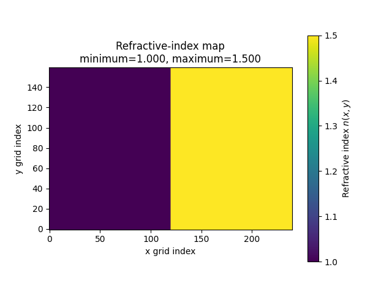

# Photonics Simulator

A Python toolkit for learning about, numerically simulating, and visualizing
two-dimensional wave propagation.

The project is being developed progressively. It begins with a scalar wave
equation and establishes the numerical and software foundations needed for
later work on dielectric interfaces, photonic geometries, and electromagnetic
FDTD methods.

## Current status

The project is currently at **Phase 2.3 - Planar dielectric interface**.

- Phase 1 implemented and validated the original two-dimensional scalar-wave
  solver.
- Phase 2.1 reorganized the solver into the reusable `wavesim` package without
  intentionally changing its numerical behavior.
- Phase 2.2 introduced validated refractive-index and wave-speed maps while
  keeping the default domain uniform.
- Phase 2.3 gave the scalar field an \(E_z\)-polarized interpretation and
  introduced one grid-aligned planar dielectric interface.

The default uniform simulation remains numerically identical to the verified
Phase 2.1 simulation. A separate Phase 2.3 scenario demonstrates qualitative
reflection, transmission, refraction, and wavelength change at an interface
between \(n=1.0\) and \(n=1.5\).

## Governing model

The current solver advances the variable-speed scalar wave equation

```math
\frac{\partial^2 u}{\partial t^2}
=
c(x,y)^2
\left(
\frac{\partial^2 u}{\partial x^2}
+
\frac{\partial^2 u}{\partial y^2}
\right).
```

For Phase 2.3, the field is interpreted as:

```math
u(x,y,t)=E_z(x,y,t),
```

where:

- \(E_z(x,y,t)\) is the out-of-plane electric-field component;
- \(c(x,y)\) is the local propagation speed;
- \(x\) and \(y\) are spatial coordinates;
- \(t\) is time.

The material relationship is

```math
c(x,y)=\frac{c_{\mathrm{ref}}}{n(x,y)},
```

where \(c_{\mathrm{ref}}\) is the reference wave speed and \(n(x,y)\) is the
refractive-index map.

The project currently uses normalized simulation units. The default material
configuration is

```text
c_ref = 1
n(x,y) = 1
c(x,y) = 1
```

throughout the default domain.

The selected \(E_z\) model assumes a two-dimensional, isotropic, lossless,
nondispersive dielectric with spatially constant magnetic permeability. It is
a reduced second-order electromagnetic model, not a complete vector Maxwell
FDTD solver.

At an ordinary interface between the selected nonmagnetic dielectrics, the
continuous model requires:

```math
E_{z,1}=E_{z,2}
```

and:

```math
\frac{\partial E_{z,1}}{\partial n}
=
\frac{\partial E_{z,2}}{\partial n}.
```

## Numerical method

The equation is discretized on a two-dimensional Cartesian grid using
second-order centered finite differences in space and time.

For interior grid cells, the undamped update is

```math
u_{i,j}^{n+1}
=
2u_{i,j}^{n}
-
u_{i,j}^{n-1}
+
\Delta t^2 c_{i,j}^2
\nabla_h^2 u_{i,j}^{n}.
```

Only interior cells are updated. The outermost cells are reserved for the
boundary condition.

For a Gaussian initial field with zero initial velocity, the previous time
level is initialized using

```math
u^{-1}
=
u^0
+
\frac{1}{2}
\Delta t^2 c(x,y)^2
\nabla_h^2 u^0.
```

## Features

The current implementation includes:

- explicit finite-difference time stepping;
- a two-dimensional Cartesian grid;
- spatial refractive-index and wave-speed arrays;
- uniform material-map construction;
- vertical planar-interface material-map construction;
- validation of material values and array shapes;
- optional injection of preconstructed material maps;
- CFL stability validation using the fastest wave speed in the domain;
- Gaussian and zero-field initial conditions;
- an optional continuous sinusoidal point source;
- fixed reflective boundaries;
- sponge absorbing boundaries;
- animated wave-field visualization;
- refractive-index-map visualization;
- material-interface contours on the wave animation;
- sponge-profile visualization;
- scalar-wave energy diagnostics;
- source wavelength and grid-resolution diagnostics;
- a dedicated planar-interface scenario;
- headless interface-propagation verification;
- regression tests that preserve the verified Phase 2.1 results.

## Project architecture

The reusable package is named `wavesim`.

```text
photonics-simulator/
|-- wavesim/
|   |-- __init__.py
|   |-- config.py
|   |-- materials.py
|   |-- solver.py
|   `-- visualization.py
|-- simulations/
|   |-- __init__.py
|   |-- wave2d_basic.py
|   `-- wave2d_planar_interface.py
|-- tests/
|   |-- test_materials.py
|   |-- test_planar_interface_scenario.py
|   `-- test_phase2_1_regression.py
|-- notes/
|   |-- mathematics/
|   |-- physics/
|   `-- simulation-logs/
|-- outputs/
|   `-- figures/
|-- README.md
`-- requirements.txt
```

### Module responsibilities

`wavesim/config.py`

- frozen configuration dataclasses;
- configuration validation;
- CFL calculation and validation;
- configuration and wavelength reporting.

`wavesim/materials.py`

- `MaterialMap`;
- uniform material-map construction;
- planar-interface material-map construction;
- material-array validation.

`wavesim/solver.py`

- finite-difference operators;
- initial-condition construction;
- source application;
- boundary handling;
- damping-profile construction;
- energy calculation;
- simulation state and time stepping;
- validation and use of optionally supplied material maps.

The solver does not depend on Matplotlib and can be used in tests or future
headless workflows.

`wavesim/visualization.py`

- material and damping profile figures;
- material-interface contours;
- wave animation;
- energy-history plotting;
- the interactive simulation workflow.

`simulations/wave2d_basic.py`

- a thin executable entry point that creates the default configuration and
  launches the interactive workflow.

`simulations/wave2d_planar_interface.py`

- a headless-compatible scenario constructor;
- a \(240\times160\) interface experiment;
- a thin interactive entry point for the Phase 2.3 simulation.

The intended dependency direction is

```text
config -> materials -> solver -> visualization -> simulation entry points
```

## Configuration

Configuration values are grouped into frozen dataclasses:

- `GridConfig`;
- `TimeConfig`;
- `MaterialConfig`;
- `InitialConditionConfig`;
- `SourceConfig`;
- `BoundaryConfig`;
- `VisualizationConfig`;
- `SimulationConfig`.

The default configuration can be created with

```python
from wavesim.config import create_default_config

config = create_default_config()
```

Because the dataclasses are frozen, variations can be constructed safely with
`dataclasses.replace`:

```python
from dataclasses import replace

from wavesim.config import create_default_config

config = create_default_config()
config = replace(
    config,
    material=replace(
        config.material,
        background_refractive_index=2.0,
    ),
)
```

This example creates a uniform medium with

```math
n=2,
\qquad
c=\frac{1}{2}.
```

### Default numerical configuration

```text
Grid
    nx = 150
    ny = 150
    dx = 1.0
    dy = 1.0

Time
    dt = 0.4
    steps = 500

Material
    reference wave speed = 1.0
    background refractive index = 1.0

Initial condition
    kind = zero
    Gaussian center = grid center
    sigma = 8.0

Source
    kind = point_sine
    position = grid center
    amplitude = 0.5
    frequency = 0.075

Boundary
    kind = sponge
    damping width = 50
    maximum damping = 0.02
    damping exponent = 2
```

## Material maps

### Uniform map

The default simulation constructs a uniform map:

```python
from wavesim.materials import create_uniform_material_map

material_map = create_uniform_material_map(
    config.grid,
    config.material,
)
```

Every cell receives:

```math
n(x,y)=n_{\mathrm{background}}
```

and:

```math
c(x,y)=\frac{c_{\mathrm{ref}}}{n(x,y)}.
```

### Planar interface

Phase 2.3 adds:

```python
from wavesim.materials import (
    create_planar_interface_material_map,
)

material_map = create_planar_interface_material_map(
    config.grid,
    config.material,
    interface_index=120,
    right_refractive_index=1.5,
)
```

The material convention is:

```python
refractive_index[:interface_index, :] = n_left
refractive_index[interface_index:, :] = n_right
```

The interface lies between x indices `interface_index - 1` and
`interface_index`. The left material uses the configured background index.

Prepared maps can be supplied explicitly:

```python
from wavesim.solver import Wave2DSimulation

simulation = Wave2DSimulation(
    config,
    material_map=material_map,
)
```

When no map is supplied, `Wave2DSimulation` constructs the default uniform map.
Every active map is validated before field allocation and CFL validation.

## Initial conditions

Supported initial conditions are:

```python
kind = "gaussian"
```

This creates a localized Gaussian pulse with zero initial velocity.

```python
kind = "zero"
```

This starts the field from rest and is normally combined with a continuous
source.

## Sources

Supported source types are:

```python
kind = "none"
```

and

```python
kind = "point_sine"
```

The point source is

```math
s(t)=A\sin(2\pi f t)
```

and is added at one grid cell after the finite-difference wave update. That
source ordering is intentional and is protected by the numerical regression
test.

The nominal wavelength at the source is calculated from the local wave speed:

```math
\lambda=\frac{c_{\mathrm{source}}}{f}.
```

The program reports grid points per wavelength and warns when the spatial
resolution falls below ten points per wavelength.

## Boundary conditions

### Fixed boundary

```python
kind = "fixed"
```

The outermost cells satisfy

```math
u=0.
```

This homogeneous Dirichlet condition produces strong reflections.

### Sponge boundary

```python
kind = "sponge"
```

A spatial damping coefficient \(\gamma(x,y)\) increases smoothly toward the
domain edges. The damped model is approximately

```math
u_{tt}
+
\gamma(x,y)u_t
=
c(x,y)^2\nabla^2u.
```

The sponge reduces artificial reflections but is not a perfectly matched
layer.

## CFL stability

The two-dimensional CFL estimate uses the maximum wave speed anywhere in the
material map:

```math
C
=
c_{\max}\Delta t
\sqrt{
\frac{1}{\Delta x^2}
+
\frac{1}{\Delta y^2}
}.
```

The simulation requires

```math
C\leq 1.
```

The program raises an error when the configured time step is unstable.

## Energy diagnostic

For the selected second-order \(E_z\) equation, the implemented mathematical
wave-energy diagnostic is

```math
E
\approx
\sum_{i,j}
\left[
\frac{1}{2c_{i,j}^2}u_t^2
+
\frac{1}{2}
\left(
u_x^2+u_y^2
\right)
\right]
\Delta x\Delta y.
```

For a source-free simulation with nonzero initial energy, the program plots
normalized remaining energy:

```math
\frac{E(t)}{E(0)}.
```

For a continuously driven simulation, the source continually injects energy,
so the program plots absolute total energy \(E(t)\).

The diagnostic is primarily intended for comparisons between simulations that
use compatible numerical parameters.

It is not the complete instantaneous Maxwell energy:

```math
E_{\mathrm{EM}}
=
\int
\left[
\frac{1}{2}\varepsilon|\mathbf{E}|^2
+
\frac{1}{2}\mu|\mathbf{H}|^2
\right]
dA,
```

because the current solver does not explicitly store \(H_x\) and \(H_y\).

## Requirements

- Python 3;
- NumPy;
- Matplotlib.

Install the dependencies with

```powershell
pip install -r requirements.txt
```

A project virtual environment is recommended. On Windows PowerShell:

```powershell
python -m venv .venv
.\.venv\Scripts\Activate.ps1
pip install -r requirements.txt
```

## Running the simulation

Run commands from the repository root.

Activate the virtual environment, then run the default uniform simulation:

```powershell
python -m simulations.wave2d_basic
```

Run the Phase 2.3 planar-interface scenario with:

```powershell
python -m simulations.wave2d_planar_interface
```

Module execution is required because `simulations` imports the reusable
top-level `wavesim` package. Direct execution such as
`python simulations\wave2d_basic.py` may not include the repository root in the
module search path.

The interactive workflow:

1. validates the configuration;
2. constructs and validates the material map;
3. checks CFL stability;
4. prints configuration and material diagnostics;
5. displays the refractive-index map;
6. displays the sponge profile when enabled;
7. animates the wave field;
8. displays the energy history after the animation closes.

### Planar-interface scenario

The Phase 2.3 scenario uses:

```text
Grid
    nx = 240
    ny = 160
    dt = 0.4
    steps = 600

Material 1
    n_1 = 1.0
    c_1 = 1.0

Material 2
    n_2 = 1.5
    c_2 = 0.667

Geometry
    vertical interface at x index 120

Source
    position = (60, 80)
    frequency = 0.05

Boundary
    kind = sponge
    damping width = 25
```

The source frequency gives:

```math
\lambda_1=20
```

and:

```math
\lambda_2\approx13.33,
```

so both materials remain above the ten-points-per-wavelength guideline.

The material map is:



The interactive result shows qualitative:

- reflection into the \(n=1.0\) material;
- transmission into the \(n=1.5\) material;
- shorter wavelength and slower propagation in the higher-index material;
- refraction of non-normal parts of the circular wavefront.

The point source reaches the interface over many incidence angles, so this
scenario is not used to measure Fresnel coefficients quantitatively.

## Running the tests

From the repository root:

```powershell
python -m unittest discover -s tests -v
```

The tests cover:

- default and non-unit uniform materials;
- planar-interface material construction and validation;
- material ownership by the simulation;
- optional supplied-map integration;
- spatial wave-speed use during time stepping;
- material-aware energy calculation;
- CFL validation using the maximum material speed;
- invalid configuration values;
- invalid material shapes and values;
- complete planar-scenario configuration;
- headless propagation across the interface;
- finite fields and energy during the interface smoke test;
- the complete verified Phase 2.1 numerical regression.

The current suite contains:

```text
26 tests
```

For the default 500-step simulation, the protected energy checkpoints are
approximately:

```text
Step 1:     0.03182002983188608
Step 50:   10.861960749063872
Step 100:  22.499974544196014
Step 250:  50.83918140302646
Step 500:  70.13486394160974
```

## Current limitations

The current Phase 2.3 model:

- evolves only the \(E_z\) field rather than the full Maxwell field set;
- supports only one vertical, grid-aligned planar interface;
- does not yet include rectangular or reusable general geometries;
- assumes spatially constant magnetic permeability;
- models only lossless, nondispersive dielectrics;
- uses normalized simulation units;
- uses a localized single-cell source;
- supports qualitative but not quantitative Fresnel analysis;
- uses a sponge layer rather than a PML;
- does not store \(H_x\) or \(H_y\);
- uses a scalar wave-equation energy diagnostic rather than complete
  electromagnetic energy;
- does not save simulation results automatically.

The point source emits circular waves over many incidence angles. A controlled
line, beam, or plane-wave-like source is required before quantitative
reflection and transmission measurements are appropriate.

## Documentation

Additional derivations, explanations, and experiment records are stored in:

```text
notes/mathematics/
notes/physics/
notes/simulation-logs/
```

Simulation logs record parameter choices, numerical changes, tests, observed
behavior, limitations, and future work.

The Phase 2 material and interface documentation includes:

```text
notes/physics/02_ez_dielectric_interface_model.md
notes/simulation-logs/phase_2/2026-07-28_001_uniform_material_map.md
notes/simulation-logs/phase_2/2026-07-28_002_planar_dielectric_interface.md
```

## Roadmap

### Phase 1 - Scalar-wave foundations

- [x] Two-dimensional finite-difference solver
- [x] CFL stability validation
- [x] Gaussian and zero initial conditions
- [x] Fixed and sponge boundaries
- [x] Continuous sinusoidal point source
- [x] Field animation
- [x] Energy and wavelength diagnostics

### Phase 2 - Material infrastructure

- [x] Phase 2.1: Modular refactor
- [x] Phase 2.2: Uniform material map
- [x] Phase 2.3: Planar dielectric interface
- [ ] Phase 2.4: Rectangular dielectric region
- [ ] Phase 2.5: Reusable geometry functions
- [ ] Phase 2.6: Phase validation

### Possible future phases

- controlled line, beam, or plane-wave sources;
- conservative interface discretizations;
- improved absorbing boundaries and PML;
- TE and TM electromagnetic FDTD solvers;
- waveguides, resonators, and scattering structures;
- automated result saving and parameter studies.

## Purpose

This project is both:

- a structured learning platform for computational photonics and numerical
  electromagnetics;
- a progressively developed technical portfolio project.

The emphasis is on understanding and validating each numerical and physical
step before introducing more advanced models.
