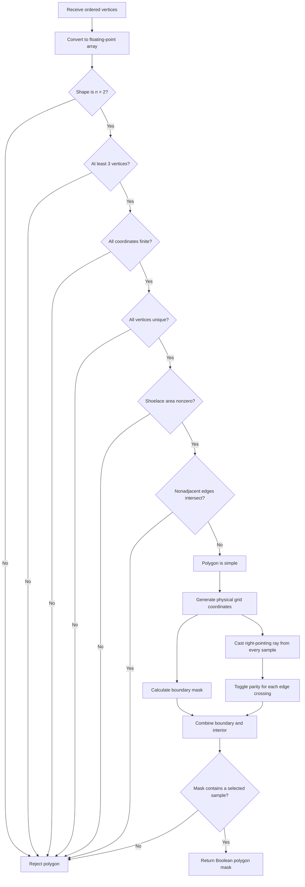

# Polygon Geometry, Validation, and Grid-Point Inclusion

> **Status:** Phase 4 mathematical reference.
>
> This note explains the geometric algorithms used to validate simple polygons
> and convert them into Boolean masks on the simulator grid.

## 1. Purpose

Phase 4 introduces material regions described by polygons.

A polygon is supplied as an ordered sequence of physical-coordinate vertices:

```python
vertices = (
    (1.0, 1.0),
    (5.0, 1.0),
    (5.0, 4.0),
    (3.0, 3.0),
    (1.0, 4.0),
)
```

Before assigning a refractive index, the simulator must answer two separate
questions:

1. Do the vertices define a valid simple polygon?
2. Which grid samples lie inside that polygon or on its boundary?

These questions correspond to these algorithmic stages:

- Ordered vertices
- Polygon validation
- Valid simple polygon
- Grid-point classification
- Boolean geometry mask
- Material assignment

Polygon validation operates only on the supplied vertices and edges.

Grid-point classification operates on every physical sample of the simulation
grid.

---

## 2. Polygon representation

Let a polygon contain $n$ ordered vertices:

```math
P_0,P_1,\ldots,P_{n-1},
```

where:

```math
P_i=(x_i,y_i).
```

Consecutive vertices form polygon edges:

```math
E_i=\overline{P_iP_{i+1}}.
```

The indices wrap around, so:

```math
P_n=P_0.
```

Consequently, the final edge is:

```math
E_{n-1}=\overline{P_{n-1}P_0}.
```

The user must not repeat the first vertex at the end. Polygon closure is
performed automatically.

For example, this rectangle is correct:

```python
vertices = (
    (1.0, 1.0),
    (4.0, 1.0),
    (4.0, 3.0),
    (1.0, 3.0),
)
```

Its edges are:

```text
P3 ●────────────● P2
   │            │
   │            │
P0 ●────────────● P1
```

The edge from `P3` back to `P0` is implied.

The following representation should not be used:

```python
vertices = (
    (1.0, 1.0),
    (4.0, 1.0),
    (4.0, 3.0),
    (1.0, 3.0),
    (1.0, 1.0),  # Repeated first vertex
)
```

Repeating the first vertex creates a duplicate vertex and a zero-length closing
edge.

---

## 3. Simple polygons

The Phase 4 polygon algorithm accepts simple polygons.

A simple polygon:

- has at least three vertices;
- contains only finite real coordinates;
- has no duplicate vertices;
- encloses a nonzero area;
- has no intersections between nonadjacent edges.

The polygon may be convex:

```text
       ●
      ╱ ╲
     ╱   ╲
    ●─────●
```

or concave:

```text
●────────●
│       ╱
│   ●──●
│   │
●───●
```

A self-intersecting polygon is not simple:

```text
●──────\ /──────●
|       ╳       |
●──────/ \──────●
```

Self-intersecting polygons are rejected because the meaning of their interior
depends on an additional fill rule. Phase 4 deliberately avoids that ambiguity.

---

## 4. Basic vertex-array validation

The vertices are converted to a floating-point NumPy array:

```python
vertex_array = np.asarray(
    vertices,
    dtype=float,
)
```

The expected shape is:

```text
(number_of_vertices, 2)
```

For example, four two-dimensional vertices produce:

```python
array([
    [1.0, 1.0],
    [4.0, 1.0],
    [4.0, 3.0],
    [1.0, 3.0],
])
```

The two columns represent x and y:

```math
\begin{bmatrix}
x_0 & y_0 \\
x_1 & y_1 \\
\vdots & \vdots \\
x_{n-1} & y_{n-1}
\end{bmatrix}.
```

At least three rows are required because fewer than three points cannot enclose
an area.

All coordinates must be finite. Values such as `NaN`, positive infinity, and
negative infinity are rejected.

---

## 5. Duplicate vertices

Every supplied vertex must be unique.

Duplicate vertices can cause:

- zero-length edges;
- ambiguous polygon traversal;
- repeated edge contacts;
- invalid intersection results.

NumPy can find unique rows with:

```python
unique_vertices = np.unique(
    vertices,
    axis=0,
)
```

If the number of unique rows differs from the original number of vertices, the
polygon contains duplicates.

---

## 6. Polygon area: the shoelace formula

Three or more distinct points can still lie on a straight line. Such vertices
do not enclose a two-dimensional region.

The polygon area is tested with the shoelace formula.

For ordered vertices:

```math
P_i=(x_i,y_i),
```

twice the signed area is:

```math
2A_s
=
\sum_{i=0}^{n-1}
\left(
x_i y_{i+1}
-
x_{i+1}y_i
\right),
```

with the wraparound convention:

```math
P_n=P_0.
```

The implementation can calculate this as:

```python
x = vertices[:, 0]
y = vertices[:, 1]

signed_double_area = np.sum(
    x * np.roll(y, -1)
    - np.roll(x, -1) * y
)
```

Consider the rectangle:

```math
P_0=(1,1),\quad
P_1=(4,1),\quad
P_2=(4,3),\quad
P_3=(1,3).
```

Then:

```math
\begin{aligned}
2A_s
&=
1(1)-4(1) \\
&\quad+4(3)-4(1) \\
&\quad+4(3)-1(3) \\
&\quad+1(1)-1(3) \\
&=12.
\end{aligned}
```

Thus:

```math
A=\frac{|2A_s|}{2}=6.
```

This agrees with the ordinary rectangle formula:

```math
A=(4-1)(3-1)=6.
```

The sign describes vertex orientation:

- $2A_s>0$: counterclockwise ordering;
- $2A_s<0$: clockwise ordering;
- $2A_s=0$: zero enclosed area.

Both clockwise and counterclockwise polygons are valid. Only zero area is
rejected.

---

## 7. Orientation of three points

The orientation test is the central operation used for segment validation.

Given three points:

```math
A=(x_A,y_A),\qquad
B=(x_B,y_B),\qquad
C=(x_C,y_C),
```

define:

```math
\operatorname{orient}(A,B,C)
=
(B_x-A_x)(C_y-A_y)
-
(B_y-A_y)(C_x-A_x).
```

This is the two-dimensional cross product:

```math
(B-A)\times(C-A).
```

Its sign indicates which side of the directed line $A\rightarrow B$ contains
$C$:

```text
                 C: positive orientation
                 ●
                 │
A ●─────────────>● B
                 │
                 ●
                 C: negative orientation
```

More precisely:

```math
\operatorname{orient}(A,B,C)
\begin{cases}
>0, & C\text{ is to the left of }A\rightarrow B,\\
<0, & C\text{ is to the right of }A\rightarrow B,\\
=0, & A,B,C\text{ are collinear.}
\end{cases}
```

For:

```math
A=(0,0),\qquad B=(2,0),\qquad C=(1,1),
```

the result is:

```math
\operatorname{orient}(A,B,C)
=
2(1)-0(1)=2.
```

It is positive, so $C$ lies to the left of the directed edge. For a
left-to-right horizontal edge, “left” corresponds geometrically to “above.”

---

## 8. Point-on-segment test

An orientation of zero means that three points lie on the same infinite line.
It does not prove that the third point lies on the finite segment.

For example:

```text
A ●──────● B                 ● C
```

The three points are collinear, but $C$ is outside segment
$\overline{AB}$.

A point $Q$ lies on the closed segment $\overline{AB}$ when:

1. $A$, $B$, and $Q$ are collinear;
2. $Q$ lies within the x bounds of the segment;
3. $Q$ lies within the y bounds of the segment.

Mathematically:

```math
\operatorname{orient}(A,B,Q)=0,
```

```math
\min(x_A,x_B)\le x_Q\le\max(x_A,x_B),
```

and:

```math
\min(y_A,y_B)\le y_Q\le\max(y_A,y_B).
```

The inequalities are inclusive because polygon boundaries are closed.

---

## 9. Segment-intersection test

Consider two segments:

```math
\overline{AB}
\quad\text{and}\quad
\overline{CD}.
```

For a proper crossing, $C$ and $D$ must lie on opposite sides of the line
through $AB$:

```math
\operatorname{orient}(A,B,C)
\operatorname{orient}(A,B,D)<0.
```

Similarly, $A$ and $B$ must lie on opposite sides of the line through
$CD$:

```math
\operatorname{orient}(C,D,A)
\operatorname{orient}(C,D,B)<0.
```

The geometry looks like:

```text
A ●       ● D
   ╲     ╱
    ╲   ╱
     ╲ ╱
      ╳
     ╱ ╲
    ╱   ╲
   ╱     ╲
C ●       ● B
```
The endpoints of each segment lie on opposite sides of the other segment's supporting line.

If both products are negative, the segments cross at an interior point.

Additional tests are required when an orientation is zero. These cases include:

- one endpoint touching the other segment;
- overlapping collinear segments;
- one collinear segment endpoint lying inside the other segment.

The point-on-segment test handles these special cases.

---

## 10. Adjacent polygon edges

Adjacent polygon edges are supposed to meet at a shared vertex.

For example:

```math
E_0=\overline{P_0P_1},
\qquad
E_1=\overline{P_1P_2}.
```

Both contain $P_1$:

```text
P0 ●────────● P1
             ╲
              ╲
               ● P2
```

This is not a self-intersection.

The first and last edges are also adjacent because the polygon closes:

```math
E_0=\overline{P_0P_1},
\qquad
E_{n-1}=\overline{P_{n-1}P_0}.
```

Therefore, self-intersection validation compares only nonadjacent edge pairs.

For $n$ edges, the number of possible edge pairs grows approximately as:

```math
O(n^2).
```

This is acceptable for the relatively small photonic geometries expected in
this project.

---

## 11. Grid-point classification

After validation, the polygon is converted into a Boolean mask.

The grid sample at array index $(i,j)$ has physical position:

```math
Q_{ij}
=
(i\Delta x,j\Delta y).
```

Each grid sample must be classified as:

- outside the polygon;
- inside the polygon;
- exactly on the polygon boundary.

The final mask is:

```math
M_{ij}
=
\begin{cases}
\text{True},
& Q_{ij}\text{ is inside or on the boundary},\\
\text{False},
& Q_{ij}\text{ is outside}.
\end{cases}
```

The interior and boundary are calculated separately:

```math
M=M_{\mathrm{inside}}\lor M_{\mathrm{boundary}}.
```

---

## 12. Why a ray is used

To determine whether a point $Q$ lies inside a polygon, imagine starting at
$Q$ and moving along a ray until reaching a location infinitely far outside
the polygon.

A bounded polygon cannot extend to infinity. Therefore, a sufficiently distant
point on the ray is always outside.

Every time the ray crosses the polygon boundary, the state changes:

```text
outside | inside | outside | inside | outside
```

Thus:

- an even number of crossings means $Q$ is outside;
- an odd number of crossings means $Q$ is inside.

This is called the even–odd rule or ray-casting rule.

---

## 13. Ray direction

The implementation chooses a horizontal ray in the positive x direction: from
$Q$ toward the right.

For:

```math
Q=(x_Q,y_Q),
```

the ray is:

```math
R(t)
=
(x_Q+t,y_Q),
\qquad t\ge0.
```

The condition $t\ge0$ is important. It makes this a half-line rather than an
infinite line.

```text
                    positive x direction
Q ●────────────────────────────────────►
```

Only edge intersections satisfying:

```math
x_{\mathrm{intersection}}>x_Q
```

belong to this ray.

That choice appears in the code as:

```python
x < intersection_x
```

Here, `x` contains the x coordinate of each grid sample $Q$.

The inequality means:

> Count the intersection only if it lies to the right of the tested point.

### Why not use the complete infinite line?

An infinite horizontal line has two directions:

```text
◄────────────────●────────────────►
                 Q
```

For an interior point in a simple bounded polygon, the complete line generally
crosses the boundary an even number of times because it eventually exits on
both sides.

For a convex polygon, it commonly produces two crossings:

```text
              polygon
         ┌───────────────┐
◄────────┼──────●────────┼────────►
         └──────Q────────┘
    left crossing   right crossing
```

Counting both gives two, which is even, despite $Q$ being inside.

The ray algorithm therefore selects only one half of the line:

```text
        ┌───────────────┐
        │      ●────────┼────────►
        └──────Q────────┘
                        one crossing
```

The right-pointing ray crosses once, giving odd parity and correctly
classifying $Q$ as inside.

### Could the ray point left instead?

Yes. A left-pointing ray would be:

```math
R(t)=(x_Q-t,y_Q),\qquad t\ge0.
```

It would count intersections satisfying:

```math
x_{\mathrm{intersection}}<x_Q.
```

The corresponding code condition would be:

```python
intersection_x < x
```

Either direction is valid as long as:

- only one half-line is used;
- the direction is applied consistently;
- vertex crossings follow a consistent convention;
- boundary points are handled separately.

The implementation chooses right simply because positive x is a natural and
convenient convention.

### What happens for concave polygons?

A ray from an interior point may cross the polygon once, three times, five
times, or another odd number of times:

```text
       ┌─────┐     ┌─────┐
       │  Q  |     |     |
       |  ●──┼─────┼─────┼──►
       │     └─────┘     |
       └─────────────────┘
```

The exact number does not matter. Only its parity matters.

Starting inside and moving toward infinity, every crossing toggles between
inside and outside. Because the final state at infinity is outside, the total
number of toggles must be odd.

Similarly, a ray starting outside must cross an even number of times before
ending outside again.

---

## 14. Determining whether an edge crosses the ray height

Suppose a polygon edge goes from:

```math
A=(x_A,y_A)
\quad\text{to}\quad
B=(x_B,y_B).
```

The horizontal ray from $Q$ lies at height:

```math
y=y_Q.
```

The edge can cross this horizontal level only if its endpoints lie on opposite
sides of the level:

```math
(y_A>y_Q)\ne(y_B>y_Q).
```

In code:

```python
edge_straddles_y = (
    (start[1] > y) != (stop[1] > y)
)
```

For example:

```text
B ●
  │
──┼──────── ray height y_Q
  │
A ●
```

This edge straddles the ray height.

A horizontal edge does not straddle the ray height:

```text
A ●────────● B

──────────────── ray height y_Q
```

The same strict `>` comparison is applied to both endpoints. This prevents a
ray passing through a polygon vertex from counting both adjacent edges.

---

## 15. Calculating the edge intersection

Parameterize the edge as:

```math
P(t)=A+t(B-A),
\qquad 0\le t\le1.
```

Its coordinate equations are:

```math
x(t)=x_A+t(x_B-x_A),
```

```math
y(t)=y_A+t(y_B-y_A).
```

At the ray height $y_Q$:

```math
y_Q=y_A+t(y_B-y_A).
```

Solving for $t$:

```math
t=
\frac{y_Q-y_A}{y_B-y_A}.
```

Substitute into the x equation:

```math
x_{\mathrm{intersection}}
=
x_A+
(x_B-x_A)
\frac{y_Q-y_A}{y_B-y_A}.
```

The implementation computes this intersection for every grid sample whose
horizontal ray is straddled by the edge.

It then checks:

```math
x_Q<x_{\mathrm{intersection}}.
```

If true, the intersection lies on the selected right-pointing ray.

---

## 16. Crossing parity with XOR

The interior array initially contains `False`:

```python
inside = np.zeros(
    grid.shape,
    dtype=bool,
)
```

For each edge crossing, the state is toggled:

```python
inside ^= ray_crosses_edge
```

XOR has the required behavior:

| Previous state | Crossing | New state |
|---|---:|---|
| Outside (`False`) | No | Outside (`False`) |
| Outside (`False`) | Yes | Inside (`True`) |
| Inside (`True`) | No | Inside (`True`) |
| Inside (`True`) | Yes | Outside (`False`) |

After all polygon edges have been processed:

- `False` represents an even number of crossings;
- `True` represents an odd number of crossings.

The algorithm does not need to store the actual crossing count.

---

## 17. Boundary detection

Ray casting primarily determines strict interior membership. Samples lying
exactly on polygon edges require an explicit boundary test.

For an edge from $A$ to $B$ and a grid sample $Q$, calculate:

```math
(B-A)\times(Q-A).
```

In component form:

```math
(B_x-A_x)(Q_y-A_y)
-
(B_y-A_y)(Q_x-A_x).
```

If this equals zero, $A$, $B$, and $Q$ are collinear.

The algorithm then verifies that $Q$ lies inside the edge’s coordinate
bounds:

```math
\min(x_A,x_B)\le x_Q\le\max(x_A,x_B),
```

```math
\min(y_A,y_B)\le y_Q\le\max(y_A,y_B).
```

If both conditions hold, $Q$ lies on the closed polygon edge.

The final mask combines interior and boundary samples:

```python
mask = inside | boundary
```

This explicitly implements the Phase 4 closed-boundary convention.

---

## 18. Concave polygons

The even–odd rule supports concave polygons without decomposing them into
triangles.

Consider:

```text
   ┌─────────────┐
   │             |
   └─────┐       |
   Q2 ●──┼───────┼──►
   ┌─────┘       |
   │             |
   └─────────────┘

Q2 is in the notch
```

A ray from a point in the polygon material crosses an odd number of edges.

A ray from a point in the concave notch crosses an even number of edges.

Therefore, the same parity rule distinguishes both regions correctly.

---

## 19. Grid clipping

Polygon clipping is implicit.

The polygon may extend beyond the simulation domain, but membership is only
evaluated at the finite grid coordinates:

```math
0\le x\le(n_x-1)\Delta x,
```

```math
0\le y\le(n_y-1)\Delta y.
```

For example:

```text
Polygon extends outside grid
        ┌──────────────────
┌───────┼───────────┐
│ grid  │ visible   │
│       │ portion   │
└───────┼───────────┘
        │
```

Only the visible grid samples can become `True`.

Therefore:

- partially visible polygons are naturally clipped;
- completely invisible polygons produce empty masks;
- empty masks are rejected by `validate_geometry_mask()`.

---

## 20. Floating-point considerations

The initial implementation uses exact comparisons:

```python
orientation == 0.0
cross_product == 0.0
signed_area == 0.0
```

This is deterministic and appropriate for simple grid-aligned coordinates such
as:

```python
(1.0, 2.0)
(4.0, 6.0)
```

However, arbitrary decimal or computed coordinates may produce rounding error.

A mathematically zero cross product might be represented as:

```text
2.220446049250313e-16
```

Consequently, a mathematically collinear sample might not be classified as
exactly collinear.

Phase 4.4 should document this limitation rather than introduce an arbitrary
tolerance without analysis. A future improvement could define a scale-aware
tolerance based on:

- grid spacing;
- edge length;
- coordinate magnitude;
- floating-point machine precision.

Such a tolerance changes geometric membership and must therefore be treated as
part of the geometry contract.

---

## 21. Computational complexity

Let:

- $n$ be the number of polygon vertices;
- $N=n_xn_y$ be the number of grid samples.

Vertex validation requires approximately:

```math
O(n^2)
```

operations because every nonadjacent edge pair may need to be checked for
intersection.

Grid rasterization requires:

```math
O(nN)
```

operations because each polygon edge is tested against every grid sample.

For the small polygons and moderate grids expected in this educational
simulator, these costs are acceptable.

More advanced spatial indexing or scan-line rasterization would only become
necessary for very large polygons, large grids, or repeated geometry updates.

---

## 22. Complete procedure

The complete polygon workflow is:



---

## 23. Summary

Phase 4 polygon construction uses the following mathematical tools:

1. The shoelace formula verifies nonzero enclosed area.
2. Cross-product orientation determines point-line relationships.
3. Bounding-box checks distinguish finite segments from infinite lines.
4. Segment-intersection tests reject self-intersecting polygons.
5. A right-pointing horizontal ray classifies polygon interiors.
6. Crossing parity distinguishes interior and exterior samples.
7. A separate boundary test implements closed polygon boundaries.
8. Grid evaluation naturally clips polygons to the simulation domain.

The essential distinction is:

> Validation determines whether the supplied vertices define a valid simple
> polygon. Ray casting determines which grid samples belong to that polygon.

The chosen ray points toward positive x. The condition

```python
x < intersection_x
```

is the exact place where that direction is encoded.
