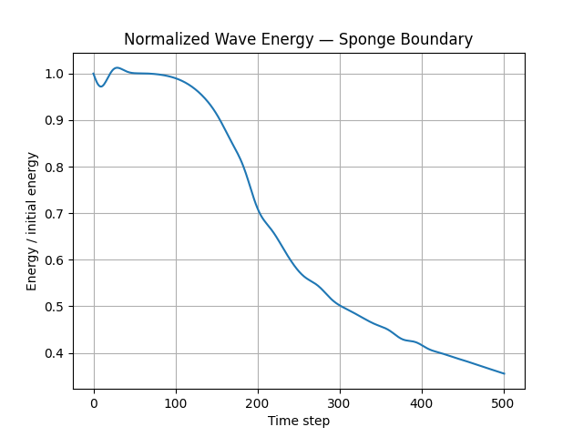

# 2026-07-17 — Sponge Boundary and Energy Diagnostics

## 1. Goal

The goal of this session was to resume Phase 1 of the Photonics Simulator project after a pause, review the current state of the 2D scalar wave-equation solver, and verify whether the sponge absorbing boundary condition was working correctly.

A specific motivation was that previous visual tests did not show a strong difference when changing the damping parameters. Therefore, the focus of this session was not only visual inspection, but also quantitative diagnostics.

---

## 2. Context

This work belongs to Phase 1 of the project.

Phase 1 focuses on a 2D scalar wave-equation simulation:

```math
\frac{\partial^2 u}{\partial t^2}
=
c^2
\left(
\frac{\partial^2 u}{\partial x^2}
+
\frac{\partial^2 u}{\partial y^2}
\right)
```

The simulation is not yet a full electromagnetic FDTD solver. Instead, it is an intermediate numerical model used to understand:

* finite-difference discretization,
* wave propagation,
* boundary conditions,
* numerical stability,
* damping/absorption,
* and diagnostic quantities such as energy.

The current code includes two selectable boundary modes:

```python
boundary_type = "fixed"
```

and

```python
boundary_type = "sponge"
```

The `fixed` boundary condition produces strong reflections from the outer edge of the domain.

The `sponge` boundary condition introduces a spatial damping profile near the edges in order to absorb outgoing waves before they reach the fixed outer boundary.

---

## 3. Files modified or reviewed

Main code file:

```text
simulations/wave2d_basic.py
```

Related documentation files:

```text
notes/physics/01_wave_equation.md
notes/mathematics/01_finite_differences.md
notes/simulation_logs/phase_1/
```
---

## 4. Current numerical model

The solver uses the scalar wave equation:

```math
u_{tt} = c^2 \nabla^2 u
```

where:

* `u` is the scalar wave amplitude,
* `c` is the wave propagation speed,
* `\nabla^2 u` is the 2D Laplacian.

The finite-difference update for the fixed-boundary case is:

```math
u_{i,j}^{n+1}
=
2u_{i,j}^{n}
-
u_{i,j}^{n-1}
+
c^2 \Delta t^2
\nabla^2 u_{i,j}^{n}
```

For the sponge boundary, the model uses a damped wave equation near the edges:

```math
u_{tt} + \gamma(x,y)u_t = c^2\nabla^2u
```

where `\gamma(x,y)` is the damping profile.

The damping coefficient is zero in the central region and increases smoothly toward the outer boundaries.

---

## 5. Current simulation parameters

The current default grid and time parameters are:

```text
nx = 150
ny = 150
dx = 1.0
dy = 1.0
c = 1.0
dt = 0.4
steps = 500
```

The initial condition is a Gaussian pulse centered in the domain:

```text
x0 = nx // 2
y0 = ny // 2
sigma = 8.0
```

The current sponge parameters are:

```text
damping_width = 50
max_damping = 0.02
damping_exponent = 2
```

The Courant number is:

```math
S =
c \Delta t
\sqrt{
\frac{1}{\Delta x^2}
+
\frac{1}{\Delta y^2}
}
```

For the current values:

```math
S =
1.0 \cdot 0.4 \cdot \sqrt{1 + 1}
\approx
0.566
```

Since:

```math
0.566 < 1
```

the simulation satisfies the CFL stability condition.

---

## 6. Boundary conditions tested

Two boundary modes were considered.

### 6.1 Fixed boundary

The fixed boundary condition forces the outer edge of the grid to zero:

```math
u = 0
```

at the boundary.

This creates strong reflections when the wave reaches the edge of the computational domain.

This case is useful as a reference because it shows what happens when waves are not absorbed.

### 6.2 Sponge boundary

The sponge boundary uses a damping coefficient `\gamma(x,y)` near the edges.

The damped wave equation is:

```math
u_{tt} + \gamma(x,y)u_t = c^2\nabla^2u
```

In the center of the domain:

```math
\gamma(x,y) = 0
```

Near the boundaries:

```math
\gamma(x,y) > 0
```

The goal is for outgoing waves to gradually lose energy inside the sponge region before reaching the outer fixed boundary.

This reduces artificial reflections.

---

## 7. Damping-profile construction

The sponge profile is created from the distance of each grid point to the nearest boundary.

For each grid point, the code computes:

```text
distance_to_edge = minimum distance to any outer edge
```

Then this distance is converted into a normalized sponge depth:

```math
d =
\frac{
w - \text{distance\_to\_edge}
}{
w
}
```

where `w` is the damping width.

The value is clipped between 0 and 1.

The damping profile is then:

```math
\gamma(x,y)
=
\gamma_{\max}
d^p
```

where:

* `\gamma_{\max}` is `max_damping`,
* `p` is `damping_exponent`.

For the current implementation:

```text
p = 2
```

so the profile grows quadratically from the inner edge of the sponge layer toward the outer boundary.

This helps avoid a completely abrupt damping transition.

---

## 8. Numerical implementation of the Laplacian

The Laplacian is computed only on the interior grid points.

The central slice is:

```python
field[1:-1, 1:-1]
```

This represents all non-boundary points.

The x-direction second derivative is computed using:

```python
field[2:, 1:-1]
- 2.0 * field[1:-1, 1:-1]
+ field[:-2, 1:-1]
```

This corresponds to:

```math
u_{i+1,j} - 2u_{i,j} + u_{i-1,j}
```

The y-direction second derivative is computed using:

```python
field[1:-1, 2:]
- 2.0 * field[1:-1, 1:-1]
+ field[1:-1, :-2]
```

This corresponds to:

```math
u_{i,j+1} - 2u_{i,j} + u_{i,j-1}
```

Therefore, the complete discrete Laplacian is:

```math
\nabla^2 u_{i,j}
\approx
\frac{
u_{i+1,j} - 2u_{i,j} + u_{i-1,j}
}{
\Delta x^2
}
+
\frac{
u_{i,j+1} - 2u_{i,j} + u_{i,j-1}
}{
\Delta y^2
}
```

This vectorized slicing avoids explicit Python loops and computes the Laplacian on the whole interior grid at once.

---

## 9. Energy diagnostic

A quantitative energy diagnostic was added to compare boundary behavior.

The approximate scalar-wave energy density is:

```math
\mathcal{E}
=
\frac{1}{2}u_t^2
+
\frac{1}{2}c^2
\left(
u_x^2 + u_y^2
\right)
```

The code approximates:

```math
u_t
\approx
\frac{
u^n - u^{n-1}
}{
\Delta t
}
```

and the spatial gradients using centered differences:

```math
u_x
\approx
\frac{
u_{i+1,j} - u_{i-1,j}
}{
2\Delta x
}
```

```math
u_y
\approx
\frac{
u_{i,j+1} - u_{i,j-1}
}{
2\Delta y
}
```

The total energy is approximated by summing the energy density over the grid:

```math
E
\approx
\sum_{i,j}
\mathcal{E}_{i,j}
\Delta x \Delta y
```

This diagnostic is not intended to be an exact conserved physical quantity in all numerical cases. However, it is useful for comparing simulations using the same grid, time step, and initial condition.

Expected behavior:

* With fixed boundaries, energy remains mostly inside the domain because waves reflect.
* With sponge boundaries, energy decreases because waves are absorbed near the boundaries.

---

## 10. Results observed

The simulations were run with different boundary and damping configurations.

The energy plot confirmed that the results are different between cases.

This means that the sponge boundary is active and that the damping parameters affect the simulation, even if visual differences in the animation are sometimes subtle.

The animation alone was not always sufficient to judge the effect of the damping coefficients. This happened because weak reflected waves can be difficult to see, especially when the color scale is too broad.

The energy diagnostic made the difference clearer.

### Observed qualitative behavior

For the fixed boundary:

```text
The wave propagates outward, reaches the domain boundary, and reflects strongly back into the domain.
```

For the sponge boundary:

```text
The wave propagates outward and loses energy near the edges. Reflections are significantly reduced compared with the fixed-boundary case.
```

### Observed quantitative behavior

```text
Fixed boundary:
Energy remaining at final step = 100.18%

Sponge boundary, case 1:
damping_width = 15
max_damping = 0.30
damping_exponent = 2
Energy remaining at final step = 13.57%

Sponge boundary, case 2:
damping_width = 50
max_damping = 0.02
damping_exponent = 2
Energy remaining at final step = 35.54%
```

---

## 11. Figures

### Figure 1 — Sponge damping profile

Add the damping-profile plot here:


```text
Figure 1. Sponge damping profile gamma(x,y). The damping coefficient is zero in the central physical region and increases smoothly toward the outer edges.
```

### Figure 2 — Field snapshot with fixed boundary


```text
Figure 2. Field snapshot for the fixed-boundary case. The reflected wave remains inside the computational domain.
```

### Figure 3 — Field snapshot with sponge boundary


```text
Figure 3. Field snapshot for the sponge-boundary case. The outgoing wave is attenuated near the boundary, reducing reflections.
```

### Figure 4 — Normalized energy plot



```text
Figure 4. Normalized wave energy as a function of time step. The sponge boundary removes energy from the domain, while the fixed boundary retains more energy due to reflection.
```

---

## 12. Interpretation

The main result of this session is that the sponge boundary condition is working.

The key evidence is that the energy plot changes between boundary configurations and confirms that energy is removed from the domain when the sponge boundary is used.

The visual animation is useful, but it can hide weak reflected waves or make different damping parameters appear similar. The energy diagnostic is therefore necessary for a more objective comparison.

The sponge boundary is not a perfect absorbing boundary. It can still produce some reflection, especially if the damping profile is too abrupt or too narrow. However, it is a significant improvement over the fixed boundary condition for open-domain simulations.

The current sponge layer is an intermediate absorbing boundary. A more advanced future option would be a perfectly matched layer.

---

## 13. Problems or limitations

The current implementation still has several limitations:

1. The model is scalar, not a full electromagnetic solver.
2. The medium is homogeneous.
3. The wave speed is constant.
4. The sponge boundary reduces reflections but does not eliminate them perfectly.
5. The sponge parameters still require systematic testing.
6. The energy diagnostic is approximate.
7. The code is still a single script rather than a modular package.
8. The simulation does not yet include continuous sources.
9. The simulation does not yet include material regions or refractive-index maps.
10. The simulation does not yet save figures automatically.

These limitations are acceptable for the current stage of Phase 1.

---

## 14. Decisions made

The following decisions were made or confirmed:

1. Keep both `fixed` and `sponge` boundary options.
2. Use the fixed boundary as a reflection reference case.
3. Use the sponge boundary as the current absorbing-boundary option.
4. Use the energy diagnostic to compare boundary behavior quantitatively.
5. Continue using a single script for now, but organize it with clear functions.
6. Add figures to simulation logs using Markdown image links.
7. Consider PML as a future advanced boundary condition, but not as the immediate next implementation.

---

## 15. Summary

In this session, the project was resumed after a pause. The current 2D scalar wave-equation solver was reviewed and improved conceptually through diagnostics.

The main result is that the sponge boundary condition was verified using the energy plot. Although visual differences between damping settings can be subtle, the energy diagnostic confirms that different boundary configurations lead to different energy behavior.

The simulation now has a stronger basis for comparing boundary conditions and is closer to completing Phase 1.
