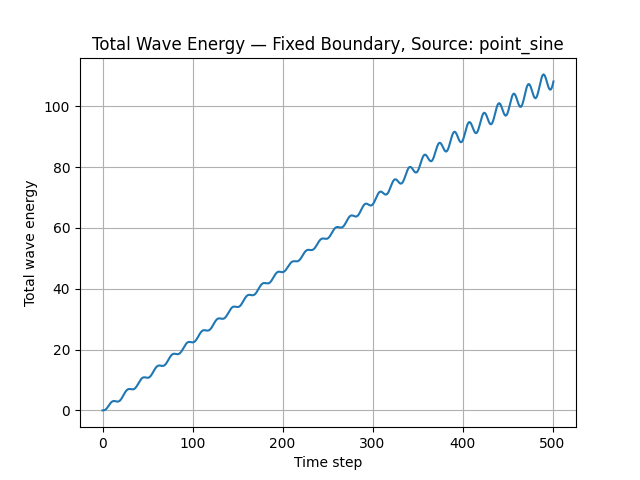

# 2026-07-21 — Continuous Point Source and Source-Compatible Energy Diagnostics

## 1. Goal

The goal of this session was to extend the 2D scalar wave simulator by adding configurable initial conditions and a continuous sinusoidal point source.

The existing simulation used only a Gaussian pulse defined at the initial time. This was useful for studying free wave propagation and boundary absorption, but it did not represent a continuously driven wave system.

The objectives of this update were therefore to:

1. Preserve the existing Gaussian-pulse simulation.
2. Add a zero-field initial condition.
3. Add a continuous sinusoidal point source.
4. Make the initial condition and source independently selectable.
5. Maintain compatibility with the fixed and sponge boundary conditions.
6. Adapt the energy diagnostic to distinguish between freely evolving and continuously driven simulations.

---

## 2. Context

This work belongs to Phase 1 of the Photonics Simulator project.

The current solver models the 2D scalar wave equation:

```math
\frac{\partial^2 u}{\partial t^2}
=
c^2\nabla^2u
```

The simulator already supported:

* a Gaussian initial pulse,
* fixed boundaries,
* sponge absorbing boundaries,
* a CFL stability check,
* field animation,
* and an approximate total-energy diagnostic.

Until this update, the simulation contained no source that continued injecting energy after the initial state.

A continuous source is useful because many wave and photonics simulations involve fields generated over time rather than only an initial disturbance.

---

## 3. Files modified

Main simulation file:

```text
simulations/wave2d_basic.py
```

Simulation log created:

```text
notes/simulation_logs/phase_1/2026-07-21_006_continuous_point_source.md
```

---

## 4. New configurable initial conditions

The simulation now supports two initial-condition options:

```python
initial_condition_type = "gaussian"
```

and:

```python
initial_condition_type = "zero"
```

### 4.1 Gaussian initial condition

The Gaussian option creates a localized initial field:

```math
u(x,y,0)
=
\exp
\left[
-\frac{
(x-x_0)^2+(y-y_0)^2
}{
2\sigma^2
}
\right]
```

This configuration is appropriate for studying:

* free pulse propagation,
* boundary reflections,
* sponge absorption,
* and energy decay after the initial excitation.

A typical configuration is:

```python
initial_condition_type = "gaussian"
source_type = "none"
```

### 4.2 Zero initial condition

The zero option initializes both stored time states as zero:

```math
u(x,y,0)=0
```

and:

```math
u(x,y,-\Delta t)=0
```

This configuration is appropriate for continuously driven simulations because the field begins at rest and all subsequent waves originate from the selected source.

A typical configuration is:

```python
initial_condition_type = "zero"
source_type = "point_sine"
```

---

## 5. Continuous sinusoidal point source

A selectable source system was added.

The currently available source options are:

```python
source_type = "none"
```

and:

```python
source_type = "point_sine"
```

The sinusoidal point source is evaluated as:

```math
s^n
=
A\sin(2\pi f n)
```

where:

* `A` is the source amplitude,
* `f` is the discrete source frequency,
* `n` is the time-step index.

The source is applied at one selected grid point:

```python
field[source_x, source_y] += source_value
```

The main source parameters are:

```python
source_x = nx // 2
source_y = ny // 2
source_amplitude = 0.5
source_frequency = 0.03
```

The current source is therefore located at the center of the computational domain.

---

## 6. Source implementation

The source is applied after computing the normal wave-equation update:

```python
u_next = step_wave(u_prev, u_curr)
apply_source(u_next, frame + 1)
```

The update sequence is:

1. Compute the Laplacian of the current field.
2. Advance the wave equation by one time step.
3. Apply the selected boundary formulation.
4. Add the source value at the selected point.
5. Calculate the diagnostic energy.
6. Shift the previous and current field arrays.
7. Update the animation.

Keeping the source in its own function separates source behavior from the solver itself.

This makes it easier to add additional source types later, such as:

* a Gaussian-modulated source,
* a finite-width source,
* a line source,
* or a plane-wave source.

---

## 7. Configuration validation

New validation checks were added for:

* the initial-condition name,
* the source name,
* the source position,
* the source amplitude,
* and the source frequency.

The recognized options are stored in sets such as:

```python
VALID_INITIAL_CONDITIONS = {"gaussian", "zero"}
VALID_SOURCES = {"none", "point_sine"}
```

The source position is required to satisfy:

```math
0 \leq x_s < N_x
```

and:

```math
0 \leq y_s < N_y
```

These checks prevent the source from being placed outside the numerical grid.

The terminal output also reports the selected initial condition and source configuration, making individual simulation runs easier to document.

---

## 8. Compatibility with existing boundary conditions

The new source system remains compatible with both available boundary modes:

```python
boundary_type = "fixed"
```

and:

```python
boundary_type = "sponge"
```

### 8.1 Point source with fixed boundary

With a fixed boundary, the continuously generated circular waves reach the outer boundary and reflect back into the domain.

Because the source continues injecting waves, the reflected waves interfere with newly generated waves.

This can produce:

* standing-wave-like patterns,
* constructive interference,
* destructive interference,
* and increasing energy stored inside the domain.

### 8.2 Point source with sponge boundary

With the sponge boundary, circular waves propagate outward and enter the absorbing region.

Their amplitude is gradually reduced before they reach the fixed outer edge.

Some reflection remains, but it is considerably weaker than in the fixed-boundary case.

The source continues injecting energy while the sponge continuously removes part of it.

---

## 9. Results observed

The point source produced clear circular wavefronts centered at the selected source position.

The observed behavior was consistent with an isotropic point-like source in a homogeneous medium.

### 9.1 Spatial behavior

The main qualitative observations were:

1. Circular waves were generated continuously from the source location.
2. The wavefronts propagated symmetrically in all directions.
3. The sponge layer attenuated the waves near the domain edges.
4. Some residual reflection was still visible.
5. The reflected waves interacted with waves newly generated by the source.

The simulation therefore showed the expected distinction between:

```text
Fixed boundary:
strong reflection and continued interference inside the domain.

Sponge boundary:
outgoing-wave attenuation with weaker residual reflection.
```

### 9.2 Suggested field figure

```md

```

```text
Figure 1. Field generated by a continuous sinusoidal point source. Circular wavefronts propagate from the source and are attenuated inside the sponge layer.
```

---

## 10. Energy-diagnostic issue

The previous energy diagnostic normalized the current energy using a reference value:

```math
E_{\mathrm{relative}}(t)
=
\frac{E(t)}{E_{\mathrm{reference}}}
```

This was appropriate for the Gaussian-pulse simulation because the system started with a finite initial energy and no further energy was added.

For the continuously driven simulation, the initial field was zero:

```math
E(0)=0
```

The source then began injecting energy into the domain.

Using the first nonzero energy as a reference produced a rapidly increasing relative-energy percentage. This percentage was mathematically calculable but not physically useful because the reference value was small and arbitrary.

---

## 11. Updated energy diagnostic

The energy display was modified according to the source configuration.

### 11.1 Free-propagation case

When:

```python
source_type = "none"
```

and the initial energy is nonzero, the plot shows normalized energy:

```math
\frac{E(t)}{E(0)}
```

This remains useful for the Gaussian pulse because it measures how much of the initial wave energy remains in the computational domain.

The animation can display:

```text
Remaining energy: XX.XX%
```

### 11.2 Continuously driven case

When:

```python
source_type = "point_sine"
```

the diagnostic shows absolute total energy:

```math
E(t)
```

The animation now displays:

```text
Total energy: [value]
```

rather than a relative percentage.

This is more appropriate because the source continuously changes the amount of energy in the domain.

---

## 12. Interpretation of source-driven energy

For a continuous source, the total energy can:

* increase while the computational domain fills with waves,
* oscillate because the excitation is sinusoidal,
* approach a fluctuating steady regime if source injection and sponge absorption approximately balance,
* or continue increasing if reflections and source injection dominate absorption.

Therefore, increasing energy is not automatically evidence of instability.

The energy curve must be interpreted together with:

* the source amplitude,
* the source frequency,
* the boundary type,
* the damping parameters,
* and the visible wave pattern.

The current energy diagnostic is useful as a general measure of stored field energy, but it is not by itself a direct measure of sponge efficiency during continuous excitation.

---

## 13. Energy plot

The final energy plot now changes according to the simulation type.

For a Gaussian pulse without a source:

```text
Normalized wave energy versus time step
```

For a continuously driven source:

```text
Total wave energy versus time step
```



```text
Figure 2. Total wave energy during continuous sinusoidal excitation. The source injects energy while the sponge layer removes part of the outgoing energy.
```

---

## 14. Current recommended configurations

### Gaussian-pulse boundary test

```python
initial_condition_type = "gaussian"
source_type = "none"
boundary_type = "sponge"
```

This configuration is useful for measuring energy decay and comparing boundary absorption.

### Continuous-source propagation test

```python
initial_condition_type = "zero"
source_type = "point_sine"
boundary_type = "sponge"
```

This configuration is useful for observing continuous circular-wave generation and residual boundary reflections.

### Continuous-source reflection test

```python
initial_condition_type = "zero"
source_type = "point_sine"
boundary_type = "fixed"
```

This configuration is useful for observing strong reflections, interference, and wave confinement.

---

## 15. Problems and limitations

The current source implementation has several limitations:

1. The source is applied at a single grid point.
2. A point source can contain strong high-spatial-frequency numerical components.
3. The source frequency is currently expressed in cycles per time step rather than a fully defined physical unit.
4. The field source is added directly after the update rather than represented as an explicit forcing term in the differential equation.
5. The total-energy diagnostic does not separate source-injected energy from sponge-absorbed energy.
6. Residual reflection remains at the sponge boundary.
7. The model still uses normalized units.
8. The model remains scalar rather than electromagnetic.

These limitations are acceptable for Phase 1.

---

## 16. Decisions made

The following decisions were made:

1. Keep both Gaussian and zero initial conditions.
2. Keep `none` and `point_sine` as selectable source types.
3. Use a zero initial field for continuous-source simulations.
4. Keep the source logic separate from the wave solver.
5. Preserve compatibility with fixed and sponge boundaries.
6. Use normalized energy only for free-propagation simulations.
7. Use absolute total energy for continuously driven simulations.
8. Do not implement central-region or cycle-averaged energy yet.
9. Keep the current point source as the first source implementation for Phase 1.

---

## 17. Next steps

The immediate next steps are:

1. Save representative continuous-source field and energy plots.
2. Add the figures to this simulation log.
3. Compare the continuous source with fixed and sponge boundaries.
4. Verify that the selected source frequency is adequately resolved by the numerical grid.
5. Document the relationship between frequency, wavelength, wave speed, and grid resolution.
6. Decide whether Phase 1 needs one additional source shape or can be concluded with the current point source.
7. Prepare a final Phase 1 summary and README update.

A useful next numerical check is:

```math
\lambda = \frac{c}{f_{\mathrm{physical}}}
```

together with the number of grid points per wavelength.

Because the current source uses a discrete frequency in cycles per time step, this relationship must be interpreted carefully using the simulation time step.

---

## 18. Summary

During this session, the simulator was extended from an initial-pulse model to a configurable continuously driven wave model.

A sinusoidal point source now generates circular waves from a selected location. The waves propagate through the homogeneous domain, enter the sponge layer, and are partially absorbed, while a smaller reflected component returns to the central region.

The energy diagnostic was also corrected so that:

* freely propagating Gaussian pulses use normalized energy,
* continuously driven simulations use absolute total energy.

This avoids misleading relative-energy percentages and makes the diagnostic consistent with the physical behavior of each simulation type.
s