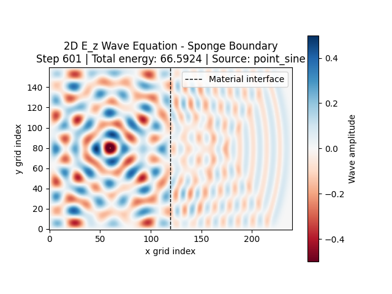
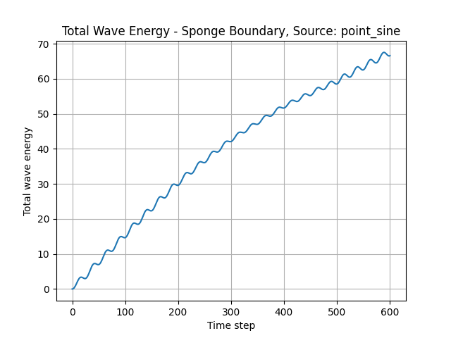

# 2026-07-28 - Phase 2.3 Planar Dielectric Interface

## 1. Goal

The goal of Phase 2.3 was to introduce the first discontinuous material
geometry into the two-dimensional wave simulator.

The selected geometry is one grid-aligned vertical dielectric interface:

```text
left material       planar interface       right material
     n_1 = 1.0      x index = 120              n_2 = 1.5
```

The main objectives were:

1. Define a physically justified interpretation for the scalar field.
2. Add a planar-interface material-map constructor.
3. Keep geometry construction outside the numerical solver.
4. Allow a simulation to receive a preconstructed material map.
5. Create a dedicated planar-interface scenario.
6. Show material boundaries on the field animation.
7. Verify interface crossing without relying only on visual inspection.
8. Preserve the uniform-material simulation and all earlier regressions.

The phase was intentionally limited to one vertical interface. Rectangular
objects and reusable general geometry tools remain reserved for later Phase 2
work.

---

## 2. Phase context

The relevant Phase 2 sequence is:

```text
Phase 2.1 - Modular refactor                 Complete
Phase 2.2 - Uniform material map             Complete
Phase 2.3 - Planar dielectric interface      Implemented
Phase 2.4 - Rectangular dielectric region    Next
Phase 2.5 - Reusable geometry functions      Planned
Phase 2.6 - Phase validation                 Planned
```

Phase 2.2 changed wave speed from one scalar value into a validated spatial
array. The default array was still uniform, so no discontinuity was present.

Phase 2.3 uses that infrastructure to create two regions with different
refractive indices. This produces reflection and transmission at their common
boundary.

---

## 3. Physics decision before implementation

Before adding the interface, the scalar field was given an explicit physical
interpretation:

```math
u(x,y,t)=E_z(x,y,t).
```

The field represents the out-of-plane electric component in a two-dimensional
\(xy\) system:

```math
\mathbf{E}
=
\left(0,0,E_z\right),
```

with in-plane magnetic components:

```math
\mathbf{H}
=
\left(H_x,H_y,0\right).
```

The selected material assumptions are:

- linear;
- isotropic;
- lossless;
- nondispersive;
- nonmagnetic;
- spatially varying permittivity;
- spatially constant permeability;
- no free surface charge or current.

Under these assumptions, the reduced Maxwell system gives:

```math
\frac{\partial^2 E_z}{\partial t^2}
=
\frac{1}{\mu\varepsilon(x,y)}
\nabla^2E_z.
```

Using:

```math
c(x,y)
=
\frac{1}{\sqrt{\mu\varepsilon(x,y)}}
=
\frac{c_{\mathrm{ref}}}{n(x,y)},
```

the equation becomes:

```math
\frac{\partial^2 E_z}{\partial t^2}
=
c(x,y)^2\nabla^2E_z.
```

This is the same variable-speed equation already implemented in Phase 2.2.

The full derivation, interface conditions, assumptions, and limitations are
recorded in:

```text
notes/physics/02_ez_dielectric_interface_model.md
```

---

## 4. Selected interface conditions

At an ordinary interface between the two nonmagnetic dielectrics, the selected
continuous model requires:

```math
E_{z,1}=E_{z,2}
```

and:

```math
\frac{1}{\mu_1}
\frac{\partial E_{z,1}}{\partial n}
=
\frac{1}{\mu_2}
\frac{\partial E_{z,2}}{\partial n}.
```

Since:

```math
\mu_1=\mu_2,
```

the normal-derivative condition reduces to:

```math
\frac{\partial E_{z,1}}{\partial n}
=
\frac{\partial E_{z,2}}{\partial n}.
```

Because permeability is constant, the selected \(E_z\) equation keeps the
spatially varying coefficient outside the Laplacian:

```math
E_{z,tt}
=
c(x,y)^2\nabla^2E_z.
```

The project does not claim that this form applies to every scalar
electromagnetic polarization. An \(H_z\) formulation or spatially varying
permeability would require a different variable-coefficient operator.

---

## 5. Files added or modified

New physics note:

```text
notes/physics/02_ez_dielectric_interface_model.md
```

New scenario:

```text
simulations/wave2d_planar_interface.py
```

New scenario tests:

```text
tests/test_planar_interface_scenario.py
```

Modified material infrastructure:

```text
wavesim/materials.py
```

Modified simulation orchestration:

```text
wavesim/solver.py
```

Modified visualization:

```text
wavesim/visualization.py
```

Expanded material tests:

```text
tests/test_materials.py
```

The uniform entry point remained available:

```text
simulations/wave2d_basic.py
```

---

## 6. Planar-interface material constructor

The following constructor was added:

```python
create_planar_interface_material_map(
    grid,
    material,
    interface_index,
    right_refractive_index,
)
```

The left side uses:

```python
material.background_refractive_index
```

and the right side uses:

```python
right_refractive_index
```

The grid convention is:

```python
refractive_index[:interface_index, :] = n_left
refractive_index[interface_index:, :] = n_right
```

Therefore, the discrete interface lies between:

```text
x index interface_index - 1
```

and:

```text
x index interface_index
```

For the Phase 2.3 scenario:

```text
interface_index = 120
```

so the transition is between columns 119 and 120.

The constructor derives the speed array using:

```math
c(x,y)
=
\frac{c_{\mathrm{ref}}}{n(x,y)}.
```

---

## 7. Interface-specific validation

The planar constructor validates:

1. `interface_index` is an integer.
2. Boolean values are not accepted as indices.
3. At least one x cell remains on the left.
4. At least one x cell remains on the right.
5. The right refractive index is finite.
6. The right refractive index is positive.
7. The final arrays have `grid.shape`.
8. All final refractive-index values are finite and positive.
9. All final wave-speed values are finite and positive.

An interface index of:

```text
0
```

or:

```text
grid.nx
```

is rejected because one of the two materials would contain no cells.

---

## 8. Optional material-map injection

Before Phase 2.3, `Wave2DSimulation` always created a uniform material map
internally.

The constructor now accepts an optional prepared map:

```python
Wave2DSimulation(
    config,
    material_map=material_map,
)
```

When no map is provided:

```python
Wave2DSimulation(config)
```

the simulation still constructs the Phase 2.2 uniform map.

When a map is provided, the simulation:

1. validates its shape and values;
2. stores the supplied map;
3. calculates the maximum wave speed from that map;
4. validates CFL stability using the supplied map;
5. uses the map during initialization, stepping, and energy calculation.

This design keeps the responsibilities separate:

```text
materials.py
    constructs geometry-dependent material arrays

solver.py
    validates and evolves the selected material arrays
```

The solver does not need to know whether the supplied map represents a planar
interface, rectangle, waveguide, or another future geometry.

---

## 9. Interactive workflow injection

The interactive workflow also accepts an optional map:

```python
run_interactive_simulation(
    config,
    material_map=material_map,
)
```

All configuration reporting and visualization use:

```python
simulation.material_map
```

so the supplied interface automatically affects:

- CFL reporting;
- source-speed and wavelength reporting;
- material minimum and maximum output;
- the material profile;
- the field update;
- the energy diagnostic;
- the interface contour.

The uniform scenario continues to call:

```python
run_interactive_simulation(config)
```

without supplying a map.

---

## 10. Dedicated planar-interface scenario

The dedicated scenario is:

```text
simulations/wave2d_planar_interface.py
```

It can be launched from the repository root using:

```powershell
python -m simulations.wave2d_planar_interface
```

The scenario exposes:

```python
create_scenario()
```

which returns:

```python
tuple[SimulationConfig, MaterialMap]
```

Keeping construction in a separate function makes the complete scenario
available to:

- the interactive entry point;
- unit tests;
- headless numerical checks;
- future result-saving workflows.

---

## 11. Scenario parameters

The Phase 2.3 scenario uses:

```text
Grid
    nx = 240
    ny = 160
    dx = 1.0
    dy = 1.0

Time
    dt = 0.4
    steps = 600

Left material
    refractive index = 1.0
    wave speed = 1.0

Right material
    refractive index = 1.5
    wave speed = 1 / 1.5 = 0.666...

Interface
    vertical
    interface index = 120

Initial condition
    kind = zero

Source
    kind = point_sine
    x = 60
    y = 80
    amplitude = 0.5
    frequency = 0.05

Boundary
    kind = sponge
    damping width = 25
    maximum damping = 0.02
    damping exponent = 2
```

The spatial layout is:

```text
x = 0           source              interface                 x = 239
|------------------*--------------------|--------------------------|
                  x=60                x=120

       n = 1.0, c = 1.0                    n = 1.5, c = 0.667
```

---

## 12. Why the scenario uses sponge boundaries

Sponge boundaries were selected for the primary interface experiment.

Fixed boundaries would strongly reflect waves from every outer edge. Since the
point source radiates in all directions, those outer-wall reflections would
overlap with the weaker dielectric reflection and make interpretation more
difficult.

The sponge does not eliminate reflections perfectly, but it reduces
contamination and provides a longer useful observation window.

Fixed boundaries remain useful as a secondary reference for:

- reflection and confinement experiments;
- long-time interference;
- source-free energy checks;
- comparison with the sponge.

They are not the preferred primary boundary for visually isolating the
dielectric interface.

---

## 13. Geometry placement

The sponge width is:

```text
25 cells
```

The left sponge occupies the region near:

```text
x = 0
```

and the right sponge begins near:

```text
x = 240 - 25 = 215.
```

The source at:

```text
x = 60
```

is outside the left sponge.

The interface at:

```text
x = 120
```

is also outside both sponge regions.

The right material therefore contains approximately 95 undamped x cells
between the interface and the start of the right sponge.

This gives the transmitted wave enough space to become visible before it
enters the absorbing layer.

---

## 14. CFL stability

The maximum wave speed is on the left:

```math
c_{\max}=1.
```

The right-side speed is lower:

```math
c_2
=
\frac{1}{1.5}
\approx
0.667.
```

The Courant number is:

```math
C
=
c_{\max}\Delta t
\sqrt{
\frac{1}{\Delta x^2}
+
\frac{1}{\Delta y^2}
}.
```

With:

```text
c_max = 1.0
dt = 0.4
dx = 1.0
dy = 1.0
```

this gives:

```math
C
=
0.4\sqrt{2}
\approx
0.566.
```

The scenario therefore satisfies:

```math
C<1.
```

The supplied-map CFL test also verifies that stability uses the fastest value
in the actual map rather than only the default material configuration.

---

## 15. Wavelength resolution

The source frequency is:

```text
f = 0.05
```

In the left material:

```math
\lambda_1
=
\frac{c_1}{f}
=
\frac{1}{0.05}
=
20.
```

With unit grid spacing:

```text
20 grid points per wavelength
```

are available.

In the right material:

```math
\lambda_2
=
\frac{c_2}{f}
=
\frac{1/1.5}{0.05}
\approx
13.33.
```

Therefore, the right material has approximately:

```text
13.33 grid points per wavelength.
```

Both values remain above the existing ten-points-per-wavelength quality
threshold.

The shorter wavelength in the right material is an expected consequence of
its lower propagation speed at the same temporal frequency.

---

## 16. Expected arrival time at the interface

The source-interface distance is:

```math
120-60=60
```

grid units.

Since the left-side speed is:

```math
c_1=1,
```

the approximate travel time is:

```math
t_{\mathrm{interface}}
\approx
\frac{60}{1}
=
60.
```

With:

```math
\Delta t=0.4,
```

the approximate arrival step is:

```math
\frac{60}{0.4}
=
150.
```

The headless propagation test advances to step 220, leaving time for the field
to cross the interface and propagate several cells into material 2.

---

## 17. Interface visualization

The field animation now derives material boundaries directly from the
refractive-index map.

The visualization:

1. obtains the unique refractive-index values;
2. calculates midpoint contour levels;
3. draws dashed black contours at material transitions;
4. adds a `Material interface` legend.

For the Phase 2.3 map:

```text
unique indices = [1.0, 1.5]
```

so the contour level is:

```math
\frac{1.0+1.5}{2}
=
1.25.
```

The contour appears between the last \(n=1.0\) column and the first \(n=1.5\)
column.

The visualization does not receive `INTERFACE_INDEX` directly. It derives the
boundary from the map, which keeps it independent of the geometry constructor.

The uniform Phase 2.2 scenario contains only one unique refractive index and
therefore displays no interface contour.

The animation title now identifies the field as:

```text
2D E_z Wave Equation
```

which matches the selected Phase 2.3 physical interpretation.

---

## 18. Headless scenario construction

The planar scenario imports Matplotlib only inside:

```python
main()
```

rather than at module import time.

This allows:

```python
create_scenario()
```

to be imported without loading the visualization system.

That distinction supports:

- headless unit tests;
- batch execution;
- numerical diagnostics;
- future parameter sweeps;
- environments where Matplotlib is unavailable.

The scenario remains a thin entry point while its configuration is still
reusable.

---

## 19. Automated tests

The complete test suite now contains:

```text
26 tests
```

The Phase 2.3 additions test:

### Material-constructor behavior

1. Correct array shapes.
2. Correct left refractive index.
3. Correct right refractive index.
4. Correct left wave speed.
5. Correct right wave speed.
6. Rejection of interface indices that leave an empty material.
7. Rejection of noninteger interface indices.
8. Rejection of non-finite right refractive indices.
9. Rejection of nonpositive right refractive indices.

### Supplied-map integration

1. `Wave2DSimulation` accepts a prepared planar map.
2. The supplied object becomes the simulation's active map.
3. CFL validation uses the supplied map.
4. The uniform fallback remains available when no map is supplied.

### Complete scenario

1. Grid, time, source, and boundary parameters are correct.
2. The material regions have the intended orientation.
3. The source and interface are outside the sponge.
4. The scenario constructs a valid simulation.
5. A wave crosses into the transmitted region.
6. Current and previous fields remain finite.
7. The energy history remains finite.
8. No obvious runaway field growth occurs during the smoke test.

The existing Phase 2.1 default numerical regression remains part of the same
suite.

The command used was:

```powershell
python -m unittest discover -s tests -v
```

The reported result was:

```text
Ran 26 tests

OK
```

---

## 20. Headless propagation check

The complete scenario is advanced for:

```text
220 steps
```

without Matplotlib.

The test confirms:

```text
step_index = 220
energy-history length = 221
```

The extra energy-history element represents the initial state at step zero.

The test checks that:

```python
np.all(np.isfinite(current))
np.all(np.isfinite(previous))
np.all(np.isfinite(energy_history))
```

It also examines a transmitted region beginning five cells beyond the
interface:

```python
current[INTERFACE_INDEX + 5:, :]
```

and requires:

```text
maximum absolute transmitted amplitude > 1e-3
```

This confirms that a measurable field crossed the interface rather than merely
appearing in the interface stencil.

A broad upper field bound is also checked:

```text
maximum absolute field < 10
```

This is a smoke-test threshold rather than an exact field regression. It can
detect severe numerical growth without making the test sensitive to small,
legitimate waveform changes.

---

## 21. Qualitative observations

The interactive scenario produced the expected qualitative behavior.

The confirmed observations were:

1. The material map displayed a vertical transition at the intended x
   position.
2. The source generated outgoing circular wavefronts in material 1.
3. The field reached the interface at approximately the expected time.
4. Part of the field propagated into material 2.
5. A weaker reflected component returned into material 1.
6. The transmitted wavelength was shorter in the \(n=1.5\) material.
7. Propagation was slower in the higher-index material.
8. Non-normal portions of the circular wavefront changed direction at the
   interface.
9. The sponge reduced outer-boundary contamination.
10. No numerical instability or non-finite field behavior was observed.

These observations are consistent with reflection, transmission, and
refraction at a dielectric boundary.

---

## 22. Normal-incidence reference

For an ideal plane wave at normal incidence between two nonmagnetic
dielectrics, the electric-field reflection coefficient is:

```math
r
=
\frac{n_1-n_2}{n_1+n_2}.
```

For:

```text
n_1 = 1.0
n_2 = 1.5
```

this gives:

```math
r=-0.2.
```

The corresponding reflected-power fraction is:

```math
R
=
|r|^2
=
0.04.
```

This explains why the interface reflection is visibly weaker than reflections
from a fixed outer boundary.

These values are included only as theoretical references. The current
point-source experiment does not measure them quantitatively.

---

## 23. Why no quantitative Fresnel result is reported

The point source emits circular waves that reach the interface over a range of
angles.

The current simulation therefore does not provide one clean incident plane
wave with one incidence angle.

Additional complications include:

- continuous source injection;
- overlap of incident and reflected fields;
- a finite domain;
- sponge interaction;
- numerical dispersion;
- a finite-difference representation of the discontinuity.

For these reasons, Phase 2.3 is limited to qualitative verification of:

- reflection;
- transmission;
- slower propagation;
- shorter wavelength;
- refraction.

Quantitative Fresnel validation should use a controlled line, beam, or
plane-wave-like source in a later phase.

---

## 24. Energy interpretation

The energy history remains the mathematical diagnostic associated with the
second-order scalar equation:

```math
E_{\mathrm{wave}}
=
\int
\left[
\frac{1}{2c(x,y)^2}E_{z,t}^2
+
\frac{1}{2}
\left|\nabla E_z\right|^2
\right]
dA.
```

It is useful for:

- regression tests;
- detecting numerical growth;
- comparing compatible wave simulations;
- observing energy removal by the sponge.

It is not the complete instantaneous Maxwell energy:

```math
E_{\mathrm{EM}}
=
\int
\left[
\frac{1}{2}\varepsilon|\mathbf{E}|^2
+
\frac{1}{2}\mu|\mathbf{H}|^2
\right]
dA.
```

The current solver evolves only \(E_z\) and does not explicitly store
\(H_x\) and \(H_y\).

Because the source continuously injects energy, increasing total energy is not
by itself evidence of instability.

---

## 25. Figures

A material-map figure was saved at:

```text
outputs/figures/phase_2/2026-07-28_planar_interface_material_map.png
```


```text
Figure 1. Refractive-index map for the Phase 2.3 planar interface. The
left region has n = 1.0 and the right region has n = 1.5. The vertical
transition appears between x indices 119 and 120.
```

The image confirms:

- the intended \(240\times160\) map shape;
- the `field[x_index, y_index]` storage convention;
- the transposed plotting orientation;
- a vertical interface at the intended position;
- minimum and maximum indices of 1.0 and 1.5.

The field and energy figures have not yet been saved. Their recommended output
locations are:

```text
outputs/figures/phase_2/2026-07-28_planar_interface_field.png
outputs/figures/phase_2/2026-07-28_planar_interface_energy.png
```

A useful field snapshot should be taken around steps 220 to 300. At that
stage, transmission is established while long-time boundary effects remain
limited. After the files are saved, they can be included here as:

```md



```

The pending figures do not affect the automated numerical tests, but adding
them will complete the visual experiment record.

---

## 26. Architecture decisions

The following decisions were made:

1. Keep the default uniform simulation unchanged.
2. Add one explicit planar-interface constructor.
3. Use the background refractive index as the left material.
4. Supply the second refractive index explicitly.
5. Define the interface location by an x grid index.
6. Make the interface convention explicit and test it.
7. Allow simulations to receive preconstructed material maps.
8. Validate every supplied map before allocating the simulation state.
9. Keep material construction outside the solver.
10. Derive visualization contours from map values rather than geometry
    metadata.
11. Keep scenario construction usable without Matplotlib.
12. Use a broad propagation smoke test instead of a fragile exact field
    regression.
13. Use sponge boundaries for the primary interface experiment.
14. Retain fixed boundaries as a possible secondary comparison.

---

## 27. Current limitations

The Phase 2.3 implementation has the following limitations:

1. Only one vertical, grid-aligned interface is supported.
2. The left medium always uses the configured background index.
3. No horizontal or rotated interface helper exists.
4. No rectangular dielectric object exists.
5. The point source is unsuitable for precise Fresnel measurements.
6. The model evolves only \(E_z\), not the full Maxwell field set.
7. The magnetic field is not stored.
8. The energy diagnostic is not the complete Maxwell energy.
9. Materials are lossless and nondispersive.
10. Magnetic permeability is spatially constant.
11. The sponge is not a PML.
12. Some numerical reflection and dispersion are expected.
13. Figures are not saved automatically.
14. Geometry is specified using grid indices rather than physical
    coordinates.

These limitations are consistent with the intentionally incremental project
plan.

---

## 28. Problems encountered

No numerical failure was observed in the implemented interface scenario.

The main design issue was deciding whether fixed or sponge boundaries should be
used for the primary test.

Fixed boundaries would make outer-wall reflections much stronger than the
dielectric reflection and would shorten the useful observation window.

The decision was therefore:

```text
Primary Phase 2.3 scenario:
    sponge boundary

Optional comparison:
    fixed boundary
```

Another important issue was avoiding a purely visual definition of success.
The headless propagation test was added so interface crossing and numerical
finiteness are checked automatically.

---

## 29. Phase 2.3 definition of done

```text
[x] E_z physical interpretation documented
[x] Interface conditions documented
[x] Planar-interface material constructor exists
[x] Interface indexing convention is explicit
[x] Interface inputs are validated
[x] Solver accepts a supplied material map
[x] Uniform fallback remains unchanged
[x] Interactive workflow accepts a supplied material map
[x] Dedicated planar-interface scenario exists
[x] Source and interface are outside the sponge
[x] Both materials satisfy the wavelength-resolution guideline
[x] Material boundary is shown on the field animation
[x] Complete scenario has automated tests
[x] Headless propagation beyond the interface is verified
[x] All fields and energies remain finite in the smoke test
[x] Existing uniform regression remains in the full test suite
[x] Full suite passes with 26 tests
[x] Qualitative reflection and transmission were observed
[x] Shorter transmitted wavelength was observed
[x] Slower propagation in the higher-index material was observed
[x] Representative material-map figure saved
[ ] Representative field and energy figures saved
[ ] README updated for Phase 2.3
[ ] Phase 2.3 commit created
```

The numerical implementation is complete. The unchecked items are phase
documentation and repository-closeout tasks.

---

## 30. Next phase

The next planned phase is:

```text
Phase 2.4 - Rectangular dielectric region
```

That phase can reuse:

- `MaterialMap`;
- material validation;
- optional map injection;
- maximum-speed CFL validation;
- local source-speed reporting;
- generic interface contours;
- headless scenario construction;
- scenario-level tests.

The new work should focus on:

1. Constructing a bounded rectangular region.
2. Defining exact inclusive or half-open index conventions.
3. Validating rectangle dimensions and placement.
4. Testing all four material boundaries.
5. Keeping the rectangle away from the sponge.
6. Observing reflection, transmission, and internal interference.

General reusable geometry helpers should remain limited until the rectangle
implementation reveals which abstractions are actually shared.

---

## 31. Summary

Phase 2.3 introduced the first discontinuous dielectric geometry into the
Photonics Simulator.

The scalar field is now explicitly interpreted as the out-of-plane electric
component \(E_z\) in a nonmagnetic, lossless, nondispersive dielectric system.

A validated planar-interface constructor creates:

```text
n = 1.0 for x < 120
n = 1.5 for x >= 120
```

and derives the corresponding wave speeds.

The simulation and interactive workflow can accept this prepared material map
without embedding geometry rules in the solver.

The dedicated scenario displayed the expected qualitative reflection,
transmission, shorter transmitted wavelength, slower propagation, and
refraction. A headless 220-step smoke test independently confirmed that the
field crosses into the second material while the fields and energy history
remain finite.

All 26 tests passed, including the earlier uniform-material regression.

The implementation is therefore ready for Phase 2.3 documentation closeout
and, afterward, the rectangular dielectric region planned for Phase 2.4.
