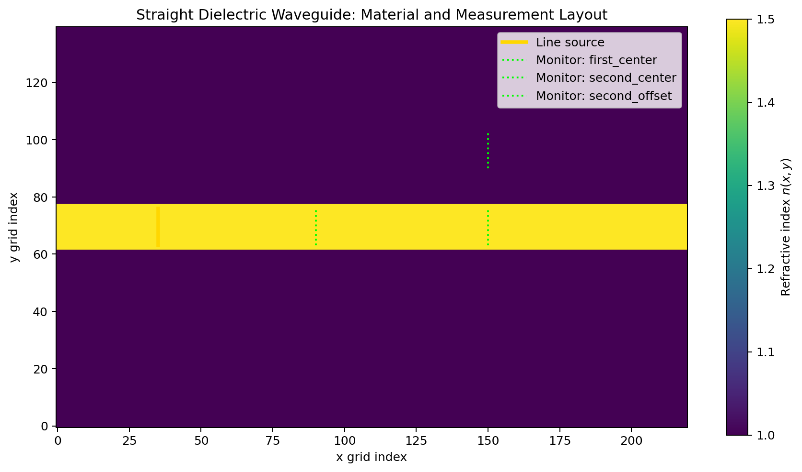
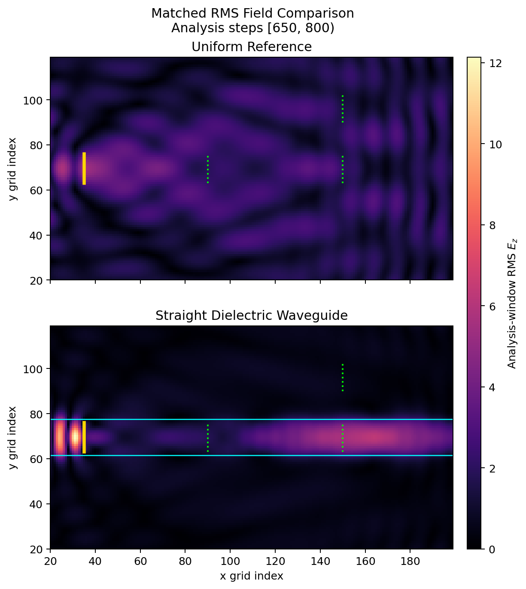
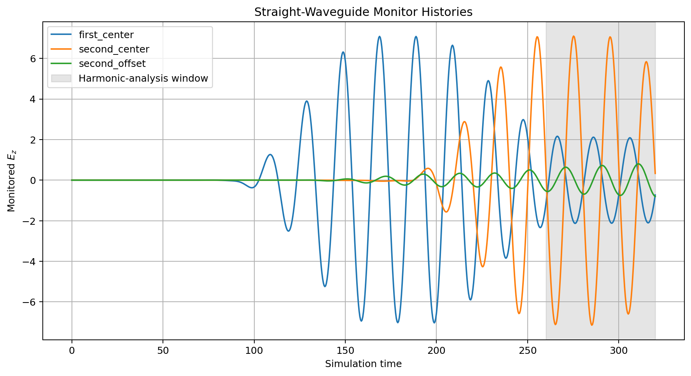
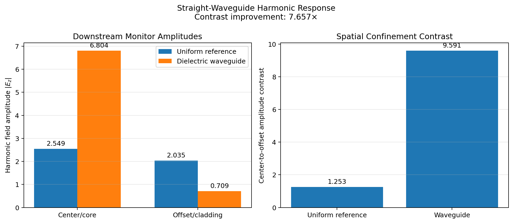

# Phase 4.2–4.6 — Advanced Geometry and Straight Dielectric Waveguide

**Date:** 2026-08-25
**Status:** Phase 4.2–4.6 implemented and numerically validated; Phase 4.7 next
**Baseline commit:** `f6211fe` — `chore: organize simulations and tests by purpose`

## 1. Objective

Phase 4 extends the validated scalar-wave simulator with reusable advanced
geometry and the first photonic structure assembled from that geometry.

Phase 4.1 previously established the common geometry contract:

- physical grid coordinates;
- Boolean geometry masks;
- closed physical boundaries;
- natural clipping to the finite grid;
- immutable material operations;
- later-operation-wins overlap behavior.

This development record covers:

- Phase 4.2: circular and elliptical regions;
- Phase 4.3: rotated rectangular and elliptical regions;
- Phase 4.4: simple polygon regions;
- Phase 4.5: declarative geometry composition;
- Phase 4.6: matched straight dielectric-waveguide experiment.

These additions do not change:

- the scalar wave equation;
- the finite-difference update;
- source injection order;
- sponge or fixed-boundary implementations;
- field-monitor sampling;
- harmonic-response estimation;
- established Phase 1–3 numerical behavior.

---

## 2. Phase 4.2 — Circular and elliptical regions

### 2.1 Physical-coordinate masks

Phase 4.2 introduced filled circular and axis-aligned elliptical masks in
physical coordinates.

For an ellipse centered at:

```math
(x_c,y_c),
```

with radii:

```math
r_x>0,\qquad r_y>0,
```

a grid sample belongs to the ellipse when:

```math
\left(
\frac{x-x_c}{r_x}
\right)^2
+
\left(
\frac{y-y_c}{r_y}
\right)^2
\le 1.
```

The use of $\le$ implements the closed-boundary convention established in
Phase 4.1.

A circle is represented as the special case:

```math
r_x=r_y=r.
```

The circle implementation delegates to the ellipse implementation rather than
maintaining a second independent membership algorithm.

### 2.2 Public operations

Phase 4.2 introduced:

```python
create_circular_mask(...)
create_elliptical_mask(...)
add_circular_region(...)
add_elliptical_region(...)
```

Mask construction and material assignment remain separate:

```text
shape parameters
    ↓
Boolean mask
    ↓
masked refractive-index assignment
    ↓
material-map finalization
```

### 2.3 Clipping

Shapes may extend beyond the physical coordinate domain.

Clipping is implicit: membership is evaluated only at the finite simulation
grid samples. Therefore:

- a partially visible shape produces a naturally clipped mask;
- a completely invisible shape produces an empty mask;
- empty masks are rejected.

### 2.4 Validation

Focused tests verify:

- physical-coordinate placement;
- grid orientation;
- closed analytical boundaries;
- independent ellipse radii;
- circle/ellipse equivalence for equal radii;
- partial clipping;
- rejection of invisible shapes;
- finite centers;
- finite, positive radii;
- immutable refractive-index assignment;
- ordered overlap behavior.

---

## 3. Phase 4.3 — Rotated rectangles and ellipses

### 3.1 Local coordinate frame

Phase 4.3 introduced physical rectangles and rotation of rectangles and
ellipses.

Instead of rotating every shape equation independently, the grid coordinates
are transformed into the local coordinate frame of the shape.

For a shape centered at:

```math
(x_c,y_c),
```

define the displaced global coordinates:

```math
\Delta x=x-x_c,
\qquad
\Delta y=y-y_c.
```

For a counterclockwise shape rotation $\theta$, the corresponding local
coordinates are:

```math
x'
=
\cos\theta\,\Delta x
+
\sin\theta\,\Delta y,
```

```math
y'
=
-\sin\theta\,\Delta x
+
\cos\theta\,\Delta y.
```

The familiar unrotated membership equation is then evaluated in
$(x',y')$.

### 3.2 Rotated ellipse

The rotated ellipse membership rule is:

```math
\left(\frac{x'}{r_x}\right)^2
+
\left(\frac{y'}{r_y}\right)^2
\le1.
```

An optional angle was added to the established ellipse API:

```python
create_elliptical_mask(
    ...,
    angle_degrees=0.0,
)
```

The zero-angle default preserves Phase 4.2 behavior.

Circles do not require an angle because a rotated circle is geometrically
identical to the original circle.

### 3.3 Physical rectangle

A physical rectangle with width $w$ and height $h$ uses:

```math
|x'|\le\frac{w}{2},
```

```math
|y'|\le\frac{h}{2}.
```

Phase 4.3 introduced:

```python
create_rectangular_mask(...)
add_physical_rectangular_region(...)
```

The word `physical` distinguishes the material operation from the established
index-based rectangle API.

### 3.4 Decision on existing rectangle APIs

The previous index-based operations were retained:

```python
add_rectangular_region(...)
create_rectangular_material_map(...)
```

They remain useful for:

- exact grid-aligned placement;
- half-open NumPy slice semantics;
- planar material interfaces;
- efficient assignments without allocating a full Boolean mask.

The project does not require every geometry operation to use the same internal
algorithm merely for architectural uniformity.

The two coordinate styles serve different purposes:

```text
Index rectangle
    exact grid indices
    half-open bounds
    efficient direct slicing

Physical rectangle
    physical center and dimensions
    closed analytical boundary
    arbitrary rotation
```

### 3.5 Validation

Focused tests verify:

- zero-angle rectangle dimensions;
- positive counterclockwise rotation;
- 90-degree axis exchange;
- ellipse zero-angle compatibility;
- 90-degree ellipse rotation;
- partial clipping;
- finite angles;
- positive width and height;
- physical material assignment;
- input-array immutability.

---

## 4. Phase 4.4 — Simple polygon regions

### 4.1 Polygon representation

A polygon is represented by an ordered sequence of physical-coordinate
vertices:

```math
P_0,P_1,\ldots,P_{n-1}.
```

The final edge automatically connects:

```math
P_{n-1}
\quad\text{to}\quad
P_0.
```

The first vertex must not be repeated at the end.

Phase 4.4 accepts simple polygons that may be either convex or concave.

Self-intersecting polygons are rejected.

### 4.2 Polygon validation

Polygon validation checks:

1. the vertex array has shape $(n,2)$;
2. at least three vertices are supplied;
3. all coordinates are finite;
4. no vertices are duplicated;
5. nonadjacent edges do not intersect;
6. the polygon encloses nonzero area.

Self-intersection is checked before area because the signed shoelace
contributions of a self-intersecting polygon may cancel.

### 4.3 Orientation test

For three points $A$, $B$, and $C$, the signed orientation is:

```math
\operatorname{orient}(A,B,C)
=
(B_x-A_x)(C_y-A_y)
-
(B_y-A_y)(C_x-A_x).
```

Its sign determines whether $C$ lies to the left or right of the directed
line $A\rightarrow B$. A zero result indicates collinearity.

This operation supports:

- point-on-segment detection;
- proper segment crossings;
- endpoint contacts;
- collinear edge overlap.

Adjacent polygon edges are excluded from self-intersection checks because they
are expected to meet at their common vertex.

### 4.4 Shoelace area

Twice the signed polygon area is:

```math
2A_s
=
\sum_{i=0}^{n-1}
\left(
x_i y_{i+1}
-
x_{i+1}y_i
\right),
```

with:

```math
P_n=P_0.
```

Clockwise and counterclockwise vertex orders are both accepted. A zero result
is rejected after the polygon has been confirmed to be simple.

### 4.5 Interior classification

Every grid sample is classified with the even–odd ray-crossing rule.

A horizontal ray is cast from the sample in the positive x direction:

```math
R(t)
=
(x_Q+t,y_Q),
\qquad
t\ge0.
```

An edge crossing is counted only when its intersection lies to the right of
the sample:

```math
x_Q<x_{\mathrm{intersection}}.
```

Each crossing toggles the inside/outside state:

```python
inside ^= ray_crosses_edge
```

An odd crossing count means inside. An even crossing count means outside.

Boundary membership is evaluated separately and then combined with the
interior mask:

```python
mask = inside | boundary
```

This explicitly preserves the closed-boundary convention.

### 4.6 Public operations

Phase 4.4 introduced:

```python
create_polygon_mask(...)
add_polygonal_region(...)
```

### 4.7 Mathematical documentation

The full mathematical derivation and geometric explanation are recorded in:

[Polygon Geometry, Validation, and Grid-Point Inclusion](../../mathematics/03_polygon_geometry_and_point_inclusion.md).

That note covers:

- polygon closure;
- shoelace area;
- orientation and cross products;
- point-on-segment detection;
- segment intersection;
- ray direction;
- crossing parity;
- boundary inclusion;
- concave shapes;
- clipping;
- computational complexity;
- floating-point limitations.

### 4.8 Floating-point limitation

The initial polygon implementation uses exact comparisons for collinearity and
zero area.

For arbitrary computed or decimal coordinates, a mathematically zero result
may be represented by a very small floating-point value. A future refinement
may introduce a scale-aware tolerance, but such a tolerance changes geometry
membership and must be treated as part of the public geometry contract.

---

## 5. Phase 4.5 — Declarative geometry composition

### 5.1 Motivation

The individual region functions support incremental composition:

```python
refractive_index = add_circular_region(
    refractive_index,
    grid,
    ...,
)

refractive_index = add_polygonal_region(
    refractive_index,
    grid,
    ...,
)
```

This remains useful for exploratory construction.

Phase 4.5 added a declarative batch workflow for reusable structures:

```python
regions = (
    MaterialRegion(circle_mask, 1.5),
    MaterialRegion(polygon_mask, 2.0),
)

refractive_index = compose_material_regions(
    background,
    grid,
    regions=regions,
)
```

### 5.2 `MaterialRegion`

`MaterialRegion` combines:

- one Boolean geometry mask;
- one finite, positive refractive index.

The region owns a defensive copy of its mask. That copy is read-only.

Therefore, modifying the source mask after region construction cannot silently
change the declared material operation.

### 5.3 Ordered composition

`compose_material_regions` applies regions in sequence.

A later region overwrites an earlier value wherever their masks overlap.

For two regions $R_1$ and $R_2$:

```text
background
    ↓ apply R1
intermediate map
    ↓ apply R2
final map
```

Where both masks are true, the final value belongs to $R_2$.

### 5.4 Efficiency

Incremental calls to `add_masked_region` each produce a defensive copy.

The batch composer produces one working copy and applies all ordered regions
to it. This avoids repeated full-array copies when a structure contains many
components.

### 5.5 Validation

Focused tests verify:

- defensive mask ownership;
- read-only region masks;
- rejection of invalid masks;
- rejection of invalid refractive indices;
- mixed circle, rectangle, and polygon composition;
- later-operation-wins precedence;
- empty composition;
- region/grid shape alignment;
- rejection of non-region sequence items;
- finalization into a valid `MaterialMap`;
- derived wave speeds.

---

## 6. Phase 4.6 — Straight dielectric waveguide

### 6.1 Objective

Phase 4.6 uses the advanced geometry and composition infrastructure to build
the first photonic structure in the project: a straight higher-index dielectric
strip.

The experiment asks whether the scalar solver shows stronger downstream
center-field concentration when the strip is present than in a matched uniform
reference.

This is a qualitative scalar-wave confinement experiment. It is not a full
electromagnetic guided-mode or power-coupling calculation.

### 6.2 Package organization

The scenario uses a self-contained package:

```text
simulations/structures/wave2d_straight_waveguide/
|-- __init__.py
|-- simulation.py
`-- figures.py
```

The numerical experiment and documentation plotting are deliberately separated:

```text
simulation.py
    configuration
    material maps
    execution
    harmonic analysis
    text report

figures.py
    RMS accumulation
    plots
    output paths
    documentation artifacts
```

Run the numerical experiment with:

```powershell
python -m simulations.structures.wave2d_straight_waveguide.simulation
```

Generate the documentation figures with:

```powershell
python -m simulations.structures.wave2d_straight_waveguide.figures
```

### 6.3 Matched material maps

The pair shares one `SimulationConfig` and differs only in material map.

Uniform reference:

```text
n = 1.0 throughout the domain
```

Waveguide:

```text
cladding index = 1.0
core index = 1.5
core center y = 69.5
core height = 16 cells
```

The straight core spans the full x coordinate range so the guided field enters
the sponge instead of terminating at a dielectric facet before the absorber.

### 6.4 Common numerical configuration

```text
Grid
    nx = 220
    ny = 140
    dx = 1.0
    dy = 1.0
    dt = 0.4
    steps = 800

Boundary
    kind = sponge
    damping width = 20

Line source
    x = 35
    y indices = [63, 77)
    amplitude = 0.5
    frequency = 0.05
    ramp = 4 cycles

First center monitor
    x = 90
    y indices = [63, 77)

Second center monitor
    x = 150
    y indices = [63, 77)

Second offset monitor
    x = 150
    y indices = [90, 104)

Harmonic analysis
    steps = [650, 800)
    samples = 150
    duration = 60
    cycles = 3
```

The shortest nominal wavelength occurs in the $n=1.5$ core:

```math
\lambda_{\mathrm{core}}
=
\frac{c_{\mathrm{core}}}{f}
=
\frac{1/1.5}{0.05}
\approx13.33
```

grid cells.

This remains above the project requirement of ten points per wavelength.

### 6.5 Monitor terminology

The shared monitor names are deliberately spatial rather than material-specific:

```text
first_center
second_center
second_offset
```

In the reference run:

- both windows lie in the same uniform material;
- `center` identifies the position where the waveguide core would be;
- `offset` identifies the matched transverse comparison window.

In the waveguide run:

- the center windows lie inside the higher-index core;
- the offset window lies in the cladding.

This naming prevents the misleading implication that the uniform reference has
a physical core and cladding.

### 6.6 Harmonic measurements

The measured amplitudes are approximately:

```text
Uniform reference
    downstream center amplitude = 2.549029
    downstream offset amplitude = 2.035060
    center/offset contrast = 1.252557

Dielectric waveguide
    downstream core amplitude = 6.803893
    downstream cladding amplitude = 0.709393
    core/cladding contrast = 9.591144

Matched comparison
    core-window enhancement = 2.669210
    cladding-window ratio = 0.348586
    contrast improvement = 7.657254
```

The contrasts are:

```math
C_{\mathrm{reference}}
=
\frac{
A_{\mathrm{reference,center}}
}{
A_{\mathrm{reference,offset}}
}
\approx1.253,
```

and:

```math
C_{\mathrm{waveguide}}
=
\frac{
A_{\mathrm{waveguide,core}}
}{
A_{\mathrm{waveguide,cladding}}
}
\approx9.591.
```

The contrast-improvement factor is:

```math
\frac{
C_{\mathrm{waveguide}}
}{
C_{\mathrm{reference}}
}
\approx7.657.
```

The center-window enhancement is:

```math
\frac{
A_{\mathrm{waveguide,core}}
}{
A_{\mathrm{reference,center}}
}
\approx2.669.
```

The cladding-window ratio is:

```math
\frac{
A_{\mathrm{waveguide,cladding}}
}{
A_{\mathrm{reference,offset}}
}
\approx0.349.
```

These quantities are amplitudes of the spatially averaged harmonic scalar
field.

They are not:

- power coefficients;
- flux measurements;
- energy fractions;
- normalized transmission probabilities.

### 6.7 Why measured amplitudes exceed source amplitude

The configured source amplitude is `0.5`, while monitored harmonic amplitudes
may be much larger.

The source is added coherently during every time step. It does not impose a
fixed field value of `0.5`.

Successive excitations can accumulate and interfere. The resulting amplitude
depends on:

- continuous source injection;
- source normalization;
- material interfaces;
- finite-domain interference;
- sponge absorption;
- monitor averaging.

The results must therefore be interpreted through matched comparisons rather
than as percentages of the configured source amplitude.

---

## 7. Reproducible Phase 4.6 figures

### 7.1 Material and measurement layout

The material figure marks:

- the $n=1.5$ core;
- the $n=1.0$ cladding;
- finite line source;
- first center monitor;
- second center monitor;
- second offset monitor.



### 7.2 Mean-centered RMS fields

The figure generator accumulates field sums and squared-field sums over the
analysis window rather than storing the complete field history.

For $N$ field samples, the displayed RMS fluctuation is:

```math
E_{\mathrm{RMS}}
=
\sqrt{
\frac{1}{N}
\sum_{m=1}^{N}
E_m^2
-
\left(
\frac{1}{N}
\sum_{m=1}^{N}
E_m
\right)^2
}.
```

The reference and waveguide panels use one shared color scale.

Only the non-sponge portion of the domain is displayed. This avoids allowing
the absorber region to dominate the documentation layout while preserving the
source and all monitors.



The uniform reference shows broad diffraction and finite-domain interference.

The dielectric strip shows substantially stronger concentration near the core.

### 7.3 Monitor histories

The monitor-history plot shows propagation reaching the first center monitor
before the downstream center and offset monitors.

The shaded region is the exact three-cycle harmonic-analysis interval.



### 7.4 Harmonic-response comparison

The response figure compares matched downstream amplitudes and
center-to-offset contrast.



---

## 8. Visualization decisions

Not every simulation or test requires a permanent figure.

A scenario should generally be visualized when it:

- introduces a new physical phenomenon;
- introduces a new material arrangement;
- represents an official milestone;
- compares multiple physical configurations;
- produces spatial behavior not communicated clearly by scalar assertions;
- provides documentation evidence.

Permanent figures are generally unnecessary for:

- low-level validation helpers;
- invalid-input cases;
- API-export checks;
- internal refactors;
- duplicated physical results.

The adopted rule is:

> Tests establish that the implementation behaves correctly. Figures explain
> what that correct behavior means physically.

Phase 4.6 satisfies both requirements: automated tests protect construction and
propagation, while the figures explain spatial confinement and matched
harmonic-response differences.

---

## 9. Validation

### 9.1 Focused geometry and composition tests

The Phase 4 geometry and public-API suite contains 44 focused tests.

These tests pass in the available headless Python runtime.

They cover:

- coordinate arrays;
- mask validation;
- circles and ellipses;
- rotations;
- physical rectangles;
- polygons;
- immutable material regions;
- mixed geometry composition;
- public package exports;
- material-map finalization.

### 9.2 Straight-waveguide tests

The straight-waveguide scenario contains 13 focused tests.

All 13 pass.

They verify:

- grid and timing parameters;
- uniform-reference map;
- higher-index strip geometry;
- source placement;
- center-monitor placement;
- offset-monitor placement;
- sponge avoidance for active components;
- three-cycle analysis window;
- CFL stability;
- wavelength resolution;
- valid simulation construction;
- complete finite histories;
- nonzero downstream propagation;
- stronger core than cladding response;
- improved contrast over the uniform reference.

### 9.3 Broader suite status

The available fallback Python runtime discovered 193 tests:

```text
191 executable tests passed
2 visualization modules could not import
```

The two unavailable modules were:

```text
tests.validation.test_monitor_visualization
tests.validation.test_waveguide_figure_generation
```

Both require Matplotlib, which is absent from the fallback runtime used for the
audit.

This is an environment dependency limitation, not a numerical test failure.

The project environment successfully generated the four Phase 4.6 PNG
artifacts, and those figures were visually inspected before README inclusion.

A complete Matplotlib-enabled suite run remains part of the Phase 4 closeout
audit.

---

## 10. Files added or extended

Primary geometry implementation:

```text
wavesim/geometry.py
wavesim/materials.py
wavesim/__init__.py
```

Straight-waveguide scenario:

```text
simulations/structures/wave2d_straight_waveguide/__init__.py
simulations/structures/wave2d_straight_waveguide/simulation.py
simulations/structures/wave2d_straight_waveguide/figures.py
```

Focused tests:

```text
tests/unit/test_geometry.py
tests/scenarios/test_straight_waveguide_scenario.py
tests/validation/test_phase4_validation.py
tests/validation/test_waveguide_figure_generation.py
```

Mathematical documentation:

```text
notes/mathematics/03_polygon_geometry_and_point_inclusion.md
```

Generated figures:

```text
outputs/figures/phase_4/2026-08-22_straight_waveguide_material_map.png
outputs/figures/phase_4/2026-08-22_straight_waveguide_rms_comparison.png
outputs/figures/phase_4/2026-08-22_straight_waveguide_monitor_histories.png
outputs/figures/phase_4/2026-08-22_straight_waveguide_response_comparison.png
```

Repository documentation updated:

```text
README.md
simulations/READ.md
tests/READ.md
notes/simulation-logs/READ.md
```

---

## 11. Scientific limitations

The Phase 4.6 experiment retains the limitations of the existing scalar model:

- the field is a scalar $E_z$-interpreted quantity;
- the solver is not a full Maxwell FDTD implementation;
- the material update is not a conservative interface discretization;
- the line source is not an eigenmode source;
- the experiment does not solve for waveguide modes;
- monitors record mean scalar field rather than transverse flux;
- measured ratios are amplitude comparisons, not power coefficients;
- the finite source diffracts;
- the sponge is not a perfectly matched layer;
- finite-domain interference remains visible;
- no convergence study has yet been performed for the waveguide result;
- exact polygon boundary classification remains sensitive to floating-point
  collinearity comparisons for arbitrary coordinates.

The phrase “waveguide confinement” in this phase means stronger matched
center-to-offset scalar-field amplitude contrast. It does not claim complete
electromagnetic mode confinement or device efficiency.

---

## 12. Definition of done

### Phase 4.2

- [x] Circular masks implemented
- [x] Elliptical masks implemented
- [x] Closed physical boundaries retained
- [x] Partial clipping validated
- [x] Circle/ellipse equivalence validated
- [x] Material-region operations implemented

### Phase 4.3

- [x] Local coordinate rotation implemented
- [x] Rotated ellipses implemented
- [x] Physical rectangles implemented
- [x] Rotated rectangles implemented
- [x] Zero-angle compatibility validated
- [x] Existing index-based rectangle APIs retained

### Phase 4.4

- [x] Simple polygon validation implemented
- [x] Convex polygons supported
- [x] Concave polygons supported
- [x] Self-intersecting polygons rejected
- [x] Ray-crossing interior classification implemented
- [x] Closed polygon boundaries implemented
- [x] Polygon mathematics note written

### Phase 4.5

- [x] Immutable `MaterialRegion` added
- [x] Defensive read-only mask ownership added
- [x] Ordered batch composition implemented
- [x] Mixed geometry composition validated
- [x] Material-map finalization validated
- [x] Phase 4 public API extended and protected

### Phase 4.6

- [x] Straight dielectric strip constructed
- [x] Matched uniform-reference map constructed
- [x] Neutral spatial monitor naming adopted
- [x] CFL and wavelength constraints validated
- [x] Downstream propagation validated
- [x] Stronger core than cladding response observed
- [x] Contrast improvement over reference observed
- [x] Reproducible figure generator added
- [x] Four documentation figures generated
- [x] Figures visually inspected
- [x] README updated
- [x] Scenario reorganized into a self-contained package
- [ ] Complete Matplotlib-enabled test suite rerun

Phase 4.2–4.6 implementation and core numerical validation are complete.

---

## 13. Next checkpoint

The next checkpoint is:

```text
Phase 4.7 — Coupled photonic structure
```

The recommended structure is a directional coupler consisting of two parallel
higher-index waveguides separated by a finite gap.

The experiment should:

1. excite only one guide;
2. measure downstream center responses in both guides;
3. compare against an isolated single-guide reference;
4. demonstrate nonzero field transfer to the initially unexcited guide;
5. visualize spatial coupling;
6. report harmonic field-amplitude ratios;
7. avoid interpreting those ratios as power transfer without a flux monitor;
8. preserve all established Phase 1–4.6 regressions.
